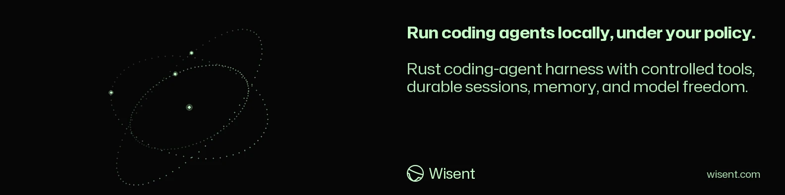
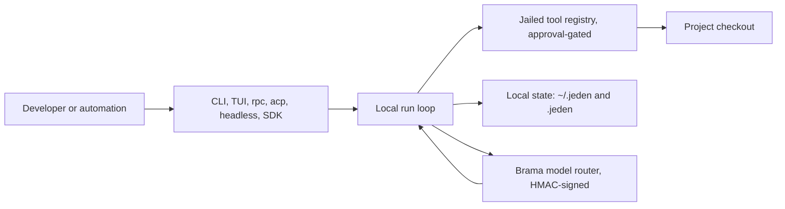

<!-- wisent-banner:start -->
<p align="center">
  
</p>
<!-- wisent-banner:end -->

<!-- wisent-readme-signals:start -->
[](https://github.com/wisent-ai/jeden) [](https://github.com/wisent-ai/jeden/issues) [](https://wisent.ai) [](https://discord.gg/qRjpkthq54) [](https://www.linkedin.com/company/wisent-ai/) [](https://x.com/wisentai) [](https://calendly.com/lbartoszcze)
<!-- wisent-readme-signals:end -->

# Jeden: The Ultimate Self-Improving Coding Agent with Internet Access, Embedded Secret Management, QA, and More

The Ultimate AI Agent for Autonomous Company Building.

Jeden is a harness for AI Agents built from real-life experiences. It routes your models intelligently, manages credentials, understands how to pursue, complete and verify tasks over time. Turns your AI into a 10x harness. Compatible with OpenAI, Anthropic, Kimi and any other model.

The Ultimate Self-Improving AI Harness. Delivered by the Wisent Team and incorporating our custom solutions into one agentic form. Experience the power of Weles (Browser Use), Skarbiec (Credential Management), Stado (Fleet Management), Tama (Automatic Blocks, Sandboxing and Hooks), Probierz (Autonomous QA), Most (Connectors), Brama (Model Routing) and Oko (Team Strategy Management Tool).

## Problem and intended users

Wisent engineers run coding agents against production-adjacent repositories and need the agent's inference path, spend attribution, and tool permissions to remain under Wisent's control rather than a third-party hosted agent's. Hosted agent products route prompts and code through external infrastructure, bill through opaque accounts, and enforce tool policy server-side.

Jeden serves two audiences:

- **Wisent engineers**, who run interactive and one-shot coding tasks in the terminal with local approval over every write and command;
- **Wisent tooling and automation**, which drives the same harness through its machine interfaces (RPC, ACP, headless mode, SDKs) inside editors and workflows.

## Product boundaries

Included capabilities are listed under [Current scope](#current-scope). Explicit non-goals:

- Jeden is not a hosted or multi-tenant service; it is a local harness.
- Jeden's local runtime is usable without a hosted Wisent account.
- Jeden does not provide model inference itself; it uses Brama or another compatible OpenAI-style endpoint and caller-supplied credentials.
- Jeden never handles cardholder data; commercial billing is owned by Wisent Platform Billing.

Supported promoted environments: Stado builds `darwin-arm64` and `linux-amd64` from `.wisent-release.json`. Jeden still supports the existing `x86_64-pc-windows-msvc` output, but Stado v1 has no Windows runner coordinate; `scripts/release/package-windows.sh` refuses rather than dropping Windows or substituting different bytes.

Operator-managed and external: the Brama URL and signing credential (Stado/Skarbiec-managed), Wisent Platform Billing configuration, and MCP server configuration.

## Core use cases

1. **Interactive task with approvals.** A Wisent engineer in a project checkout wants a code change executed and reviewed. They run `jeden` and type the task; the agent works through jailed tools, and every file write or shell command pauses for interactive approval unless explicitly enabled. The result is the applied change with visual diffs and a full transcript under `~/.jeden/sessions/`. Constraint: no write or command executes without a grant, and destructive confirmations default to **Cancel**.
2. **One-shot scripted task.** Automation needs a bounded task without a terminal. It runs `jeden run "<task>"`, optionally with `--allow-write` or `--allow-command`. The result is the final answer on stdout with the session recorded. Constraint: grants are explicit per invocation, and failover never occurs after model output has become visible.
3. **Continuing prior work.** An engineer wants to inspect or resume earlier work. They use `jeden sessions`, `show`, `export`, or `resume`. The result is a fresh session seeded with the selected history; abandoned history is never deleted.
4. **Editor and machine integration.** An editor extension or a CI job needs the same harness programmatically. It uses `jeden acp`, `jeden rpc`, `jeden headless`, or the TypeScript/Python SDKs. The result is protocol-level access to the same run loop; non-terminal output is deterministic text.

## Design contract

Jeden separates four concerns:

- **Inference** — model calls go through Brama using HMAC-signed OpenAI-compatible chat completions.
- **Policy** — the harness prompt and approval rules are explicit and local.
- **Tools** — a small allowlisted registry enforces path jails and write or command permission.
- **Run loop** — the model may return native tool calls or strict JSON actions that enter the same local execution loop.

Tool schemas are derived from each input contract and sent with the model request. Tool results are recorded in the session and returned to the model until it produces a final answer.

## How it works

Jeden is a single local process. A task enters through one interface and one run loop drives it to completion: the loop sends the conversation and the derived tool schemas to Brama, receives either a final answer or tool calls, executes each tool locally under the path jail and the approval policy, appends the outcome to the session ledger, and repeats until the model answers. Nothing but that local process reads the checkout, and inference is reachable only through Brama — Jeden carries no provider API key and no provider SDK.



- **Durable state:** Sessions live under `~/.jeden/sessions/` (`JEDEN_SESSION_ROOT` overrides). Each session directory holds `state.json` and `transcript.jsonl`, an append-only ledger of sequenced, parent-linked, checksum-sealed events that is validated on read and `fsync`ed on every append. Durable memory is SQLite/FTS at `~/.jeden/memory.sqlite3` (`JEDEN_MEMORY_DB` overrides). The rest of `~/.jeden/` holds `.env`, `config.json`/`config.yml`, the Brama model-catalog cache, and user-scoped `tools/`, `extensions/`, `commands/`, and `plugins/`. Per-project state lives in `<cwd>/.jeden/`. All of it is on the operator's disk; Jeden uploads none of it.
- **Credential boundary:** `WISENT_APP_AGENT_AUTH_SECRET` is read from the process environment only. `bin/jeden-rust` and `scripts/run-with-stado.sh` read the Skarbiec item `agent:wisent-app` and export it into that environment; `/setup` writes only non-secret values (`BRAMA_URL`, `WISENT_APP_AGENT_ID`, model, preferences) to `~/.jeden/.env` at mode `0600` and never writes the secret. Each Brama request carries `x-agent-id`, `x-agent-timestamp`, `x-agent-body-sha256`, and `x-agent-signature`, an HMAC over the request body, so the secret itself never leaves the process. Configured and automatically discovered secret values are replaced with `[REDACTED]` in the model-bound copy of the context while the local transcript keeps the original text.
- **Network boundary:** Jeden initiates every connection. The terminal, `jeden run`, `jeden rpc`, and `jeden acp` are stdio-only and open no socket; listening sockets exist only in the opt-in `jeden headless <addr>` (mutual TLS), `jeden collab-relay`, and `jeden stats --serve` (bound to `127.0.0.1`). The one required outbound dependency is `BRAMA_URL`. Optional outbound dependencies activate only when configured: Wisent Platform Billing for subscription and quota decisions, the Stado integration API for onboarding bundles and funnel events, the Stado media router for image and speech tools, and the release manifest host for `jeden update`. Tool-initiated network access (`fetch_url`, `fetch_readable_url`, SSH) is checked against the execution grant's host and port allowlist, rejects non-`http(s)` schemes and URL userinfo, resolves and pins the address, re-authorizes every redirect, and refuses non-public addresses unless the grant permits them.
- **Failure boundary:** Everything fails closed. Without `BRAMA_URL` the run stops with `BRAMA_URL is required` and no model call is made. Write and command tools stop for approval unless `--allow-write`, `--allow-command`, or `--yolo` is passed, and project hooks in `.jeden/hooks.json` run only with `--allow-command` so a cloned repository cannot silently execute shell. Transient model errors retry with the router's backoff, but neither retry nor subscription failover happens once model output has become visible. A typed quota-exhaustion response records a `Retry-After`-bounded cooldown in `.jeden/subscription-cooldowns.json` and the next eligible subscription is selected. A transcript with a truncated tail refuses further appends and must be resumed into a child session. `jeden update` stages, journals, and post-health-checks the new binary, and restores the last-known-good copy when any step fails.

The exact action, tool-call, selector, and anchored-patch wire contract is in [docs/JSON_ACTION_PROTOCOL.md](docs/JSON_ACTION_PROTOCOL.md).

## Quick start

Prerequisites:

- a supported platform (`aarch64-apple-darwin`, `x86_64-unknown-linux-gnu`, `x86_64-pc-windows-msvc`) or a Rust toolchain for source builds;
- a Brama-compatible model endpoint and caller-owned signing credential;
- optional: Wisent Platform Billing URL and token for billing-attributed routing.

From source (the currently documented path):

```sh
git clone https://github.com/wisent-ai/jeden.git && cd jeden
cargo build --locked --release   # or: bin/jeden-rust, which rebuilds stale source binaries
```

Required environment for real model calls:

```sh
WISENT_APP_AGENT_AUTH_SECRET=<signing-credential>
BRAMA_URL=<brama-model-router-url>
# Set only when Brama requires its distinct bearer.
BRAMA_TOKEN=<brama-bearer>
WISENT_APP_AGENT_ID=wisent-app
```

`ENTITLEMENTS_ROUTER_BIN` optionally overrides the local `entitlements-router` executable used by authentication status commands.

First run:

```sh
jeden            # opens the welcome view; run /setup to connect the model router
```

On a configured Wisent workstation, `bin/jeden-rust` automatically obtains the
agent signing credential from `agent:wisent-app/value` for interactive sessions
and `jeden run`; it remains in the process environment only. A deployment that
requires the optional Brama bearer must inject `BRAMA_TOKEN` separately.

The first-use journey (`/onboarding`) is separate from `/setup` and always runs
from the definition compiled into the binary, so it works offline and completes
on the first successful agent turn. When `STADO_INTEGRATION_API_URL` is set, the
launcher additionally injects `JEDEN_STADO_INTEGRATION_TOKEN` from the Skarbiec
item `jeden-integration-api` through the dedicated `jeden-onboarding-client`
consumer, which turns on published-bundle reads and funnel events at the
integration boundary. A missing endpoint, grant file, or item leaves the journey
offline and never blocks the command.

Inside the terminal, `/setup` is an idempotent wizard (Brama URL, agent id, default model, and preferences) that never writes secrets to disk; `/setup validate` probes live state and ends with a smoke call. A successful setup is observable:

```sh
jeden run "Respond exactly: OK"   # expected output: OK
```

Probierz owns reproducible Jeden journey execution and quality evidence. The
`jeden probierz` command forwards arguments to a sibling Probierz source
checkout, `PROBIERZ_ROOT`, or an installed `probierz` CLI. With no arguments it
shows the current Jeden evidence status:

```sh
jeden probierz
jeden probierz check tui
jeden probierz run tui --app jeden \
  --spec packages/tui/specs/jeden-onboarding-first-use.spec.mjs --record
```

The onboarding journey performs one real signed agent turn and stores its
source-bound result and analysis in the Probierz evidence store.

`jeden doctor` diagnoses missing prerequisites and degraded services. Stado publishes immutable candidate and stable archives for the supported fleet coordinates, and `jeden update` moves an installed binary along a verified channel; see [Release automation](#release-automation).

Common setup failures and recovery:

- `BRAMA_URL is required` — the Brama endpoint is not configured; run `/setup` or export the variable above, then rerun the command.
- `WISENT_APP_AGENT_AUTH_SECRET` missing — launch through `bin/jeden-rust` or `scripts/run-with-stado.sh`; both obtain `agent:wisent-app/value` without writing it to disk.
- Model calls fail with quota exhaustion — the active Weles subscription is in cooldown; check `/subscriptions status` or wait for the `Retry-After` bound while the router selects the next eligible subscription.
- Anything else — run `jeden doctor` for per-service health and `/setup validate` for an end-to-end probe; both report what failed and which step to fix first.

Cleanup: uninstalling is deleting the built binary and, optionally, Jeden's state — user-level under `~/.jeden/` (sessions, memory, configuration) and project-level `.jeden/` directories in the checkouts where it was used.

## Primary interfaces

- **CLI** (`jeden`, `jeden run`, management subcommands) — canonical for human interactive and one-shot use.
- **Interactive terminal views and slash commands** — canonical for in-terminal management; non-terminal stdin renders deterministic text lists for scripts.
- **`jeden rpc` (NDJSON), `jeden acp`, `jeden headless`** — canonical for automation and editor integration; `--json` flags cover scripting.
- **SDKs** — `packages/sdk-typescript` and `python/jeden_sdk` for embedding the machine interfaces.
- **MCP** — the extension interface for external tool servers.

## Current scope

The private milestone includes the capabilities below. Per-capability implementation status is tracked in [docs/JEDEN_PRODUCT_COMPLETENESS.md](docs/JEDEN_PRODUCT_COMPLETENESS.md); anything marked there as `partial` or `missing` is not promised as finished behavior.

- interactive terminal and one-shot `jeden run` modes;
- session transcripts and artifacts under `~/.jeden/sessions/`;
- model routing through required `BRAMA_URL`, `WISENT_APP_AGENT_ID`, and `WISENT_APP_AGENT_AUTH_SECRET`;
- model selection through `--model`, `JEDEN_MODEL`, or native config;
- jailed filesystem, document, archive, image, SQLite, search, Git, process, evaluation, URL, artifact, memory, todo, delegation, and MCP tools;
- guarded file mutations using the digest or snapshot tag returned by `read_file`;
- custom JavaScript tools from `~/.jeden/tools/` and `<cwd>/.jeden/tools/`;
- project and user lifecycle hooks;
- native `.jeden` configuration, context, command, extension, plugin, memory, and mode-state paths;
- interactive approval for writes and commands unless explicitly enabled.

File mutations return Jeden-native visual diffs and previews. Oversized tool results are persisted as session artifacts and replaced in the model loop with a compact reference.

## Tool policy

- Discover files with `glob_paths` or `list_dir` before reading unknown paths.
- Search content with `grep_regex` or `search_files` rather than shell discovery commands.
- Use targeted `read_file` selectors instead of dumping large files.
- Retry with a narrower path or alternate pattern before concluding that a symbol is absent.
- Use `run_package_script` for declared package scripts and reserve general process tools for commands without a safer built-in.
- Verify behavior changes with the narrowest relevant check.

## CLI

```sh
jeden
jeden --cwd ../echo
jeden run "summarize package.json"
jeden run "create notes.txt" --allow-write
jeden run "inspect the build" --allow-command
jeden sessions
jeden show <session>
jeden export <session> <output>
jeden artifacts <session>
jeden artifact <session> <name> <output>
jeden resume <session> "continue"
jeden search-sessions "query"
jeden recall_conversation --list
jeden tools --cwd ../echo
jeden config --cwd .
jeden doctor --cwd .
jeden capabilities --json --cwd .
jeden roadmap list --status planned --priority P1 --json --cwd .
```

## Interactive terminal views

In a terminal, management commands without arguments open native searchable views instead of printing command syntax. This covers authentication, models, settings, approval policy, sessions, todos, modes, tools, MCP and SSH configuration, usage, memory, browser state, collaboration, jobs, extensions, plugins, and marketplaces. Selecting a row dispatches the same validated slash command that can still be entered directly.

Picker controls:

- type to filter labels, details, and status badges;
- `Up` and `Down` move the active row;
- `Home`, `End`, `PageUp`, and `PageDown` jump through the list;
- `Ctrl-U` clears the filter;
- `Enter` executes the selected action;
- `Esc` closes the current view.

Destructive rows open a confirmation view with **Cancel** selected by default. Move to **Confirm** and press `Enter` to execute. Agent `ask_user` calls use the same terminal-owned event loop: option questions open a picker and open questions accept free text without allowing a worker thread to read terminal input directly.

When stdin is not a terminal, interactive views render as deterministic text lists and direct slash arguments remain available for scripts.

## Roadmap Registry

`roadmap/roadmap.yaml` is the canonical, versioned team roadmap. `roadmap/schema/roadmap-v1.schema.json` defines the machine contract; `docs/JEDEN_NEXT_PHASES_PLAN.md` and `roadmap/views/JEDEN_NEXT_PHASES_PLAN.md` are deterministic generated views. Every mutating operation is serialized through a stable sibling lock, validates an `expectedRevision`, writes a same-directory temporary file, flushes and fsyncs it, renames it over the YAML, and fsyncs the parent directory. Pass `--revision <n>` in automation; an omitted revision uses the snapshot read by that invocation and still fails if another writer commits first.

Statuses are explicit: `backlog`, `planned`, `in_progress`, `implemented`, `not_run`, `failed`, `external_blocked`, `passed`, and `dropped`. `passed` requires evidence; `external_blocked` requires an external prerequisite. Dependencies must resolve and remain acyclic, and capability IDs must exist in the capability registry.

```sh
jeden roadmap list --status planned --priority P1 --json --cwd .
jeden roadmap show JED-024 --json --cwd .
jeden roadmap graph --json --cwd .
jeden roadmap add --title "<title>" --area agent-quality --priority P1 \
  --summary "<summary>" --acceptance "<observable criterion>" \
  --revision "$REVISION" --cwd .
jeden roadmap implemented "$ITEM_ID" --revision "$REVISION" --cwd .
jeden roadmap block "$ITEM_ID" "Waiting for an external prerequisite" \
  --revision "$REVISION" --cwd .
jeden roadmap pass "$ITEM_ID" --evidence "artifact://$ARTIFACT_NAME" \
  --revision "$REVISION" --cwd .
jeden roadmap depends "$ITEM_ID" "$DEPENDENCY_ID" --revision "$REVISION" --cwd .
jeden roadmap acceptance evidence "$ITEM_ID" "$ACCEPTANCE_ID" \
  "artifact://$ARTIFACT_NAME" --revision "$REVISION" --cwd .
jeden roadmap work JED-024 --cwd .
jeden roadmap check --json --cwd .
jeden roadmap render --cwd .
```

The same operations are available through `/roadmap ...`. Entering `/roadmap` without arguments opens the native searchable picker; its **Add roadmap item** row prefills an editable command containing the required title, area, priority, summary, and acceptance fields. Optional dependencies and external prerequisites use repeated `--depends-on` and `--external-prerequisite` flags. `roadmap work <id>` sets the active goal and plan, creates todos from the item's acceptance criteria, records `roadmap_item_started` in the current session ledger, and pins subsequent session artifacts and branches to `activeRoadmapItem`.

## Billing and subscription routing

Wisent Platform Billing owns billing. The current compatibility transport still reads `WELES_URL` and `WELES_TOKEN`; those names will migrate without changing the billing authority. Weles Automation is not the billing owner. Jeden never accepts or stores card numbers, CVC/CVV values, processor tokens, or addresses. `/payment-method setup --account <id>` opens the configured platform-hosted HTTPS setup URL.

The interactive slash surface provides:

- `/billing policy get|set|reset` for an explicit, revision-pinned purchase policy with product, currency, per-purchase, and per-period caps;
- `/subscriptions list|status` for redacted subscription and quota views;
- `/subscriptions purchase|renew|disable` for approved, caller-idempotent mutations.

`policy set` requires `--approve`; automatic purchase and renewal remain disabled until the Weles policy is explicitly enabled. Financial mutations require a caller-supplied idempotency key and are validated against pinned policy and quote revisions by Weles.

For model calls, Jeden discovers active Weles subscriptions and their quota snapshots. It freezes a deterministic order per logical request, sends the selected `billingTarget` to Brama, and preserves the same request, idempotency, and decision identities across attempts. A typed quota-exhaustion response moves the target into a durable, `Retry-After`-bounded cooldown and selects the next eligible subscription. Failover never occurs after model output has become visible. The served account, subscription, quota bucket, and decision ID are recorded in the session audit and usage ledger.

## Release automation

The exact release version is the SemVer in `Cargo.toml`. Stado reads it through `.wisent-release.json` and passes that exact value, source directory, output directory, and platform to the checked-in `scripts/release/*` entrypoints; no run number or provider identity participates in the version.

Each supported fleet runner performs a locked release compile and stages the real `jeden` executable with SPDX SBOM, in-toto/SLSA provenance, and a DSSE evidence payload. Stado archives the declared stage mapping, records the source and build receipts, and obtains release signatures from Skarbiec-owned authority before candidate or stable promotion. Stable promotion reconciles the declared runtime without rebuilding bytes.

`darwin-arm64` and `linux-amd64` are canonical promoted outputs. The existing MSVC Windows output remains an explicit prerequisite: until Stado has a Windows fleet runner, `scripts/release/package-windows.sh` exits with a refusal and the manifest does not pretend that a Darwin or Linux runner produced Windows bytes.

## Configuration and context

User config loads from `~/.jeden/config.json` and `~/.jeden/config.yml`. Project config loads from `<cwd>/.jeden/config.json` and overrides user config. Environment variables still win over file config.

Before each run, Jeden loads user context from `~/.jeden/instructions.md` and `~/.jeden/context.md`. Project context walks from the project ancestor to `--cwd` and reads:

- `JEDEN.md`
- `AGENTS.md`
- `CLAUDE.md`
- `RULES.md`
- `.jeden/instructions.md`
- `.jeden/context.md`

A context line such as `@./extra.md` imports another file under the same context root. Oversized context files are skipped.

File-based custom commands load from project and user `.jeden/commands/` directories. Native extensions load from project and user `.jeden/extensions/` directories. Plugin and marketplace state lives under `~/.jeden/plugins/`.

## Sessions and memory

`jeden export`, `show`, `artifacts`, `artifact`, `search-sessions`, `resume`, and `recall_conversation` inspect or reuse recorded work. Resumed work starts a fresh session seeded with the selected history.

`/checkpoint [label]` records the exact model-visible context, `/checkpoint list` prints durable checkpoint event IDs, and `/rewind <checkpoint-event-id>` appends a new active lineage without deleting abandoned history. In the interactive attachment tray, `/attach <relative-path>`, `/attachments`, and `/detach <id|all>` manage bounded workspace-jailed text and PNG, JPEG, GIF, or WebP inputs consumed by the next submitted turn.

Durable memory uses SQLite/FTS at `~/.jeden/memory.sqlite3` by default. `JEDEN_MEMORY_DB` selects another database; legacy `JEDEN_MEMORY_FILE` remains an input-path override. `/memory enqueue`, `/memory queue`, `/memory queue run`, `/memory queue drain`, and `/memory rebuild` expose durable worker and index maintenance.

## MCP and hooks

MCP servers load from `~/.jeden/mcp.json` and `<cwd>/.jeden/mcp.json` using the standard `mcpServers` shape. Generic MCP tools list and call server tools, resources, and prompts; configured server tools may also appear under native `mcp__<server>__<tool>` names.

Shared lifecycle hooks receive user-prompt, pre-tool, post-tool, session-start, and stop events. Hook output may add context, replace supported input fields, or block an action through the documented decision contract.

## Custom tools

Custom modules export a default factory that receives the current workspace helpers and returns one tool or a list of tools. Tool names must be unique and cannot collide with built-ins. Custom execution remains subject to the same jail, approval, and hook policy as built-in tools.

List active tools with:

```sh
jeden tools --cwd .
```

## JSON action protocol

The complete native action, tool-call, selector, and anchored-patch contract is documented in [docs/JSON_ACTION_PROTOCOL.md](docs/JSON_ACTION_PROTOCOL.md).

## Operational model

| Concern | Contract |
|---|---|
| Configuration | Process environment wins over every file. At startup Jeden loads `<cwd>/.env`, `.env.local`, `.env.production`, `.env.vercel`, then `~/.jeden/.env`, and each file sets only variables that are still unset. Project `<cwd>/.jeden/config.json` overrides user `~/.jeden/config.json` and `~/.jeden/config.yml`. `/setup` appends non-secret keys to `~/.jeden/.env` at mode `0600` and applies them to the running process; other file changes take effect on the next invocation. |
| State | Operator-owned and local. User scope `~/.jeden/`: `sessions/`, `memory.sqlite3`, `.env`, `config.json`/`config.yml`, `cache/`, `tools/`, `extensions/`, `commands/`, `plugins/`, `hooks.json`, `mcp.json`. Project scope `<cwd>/.jeden/`: `config.json`, `usage.json`, `mode-state.json`, `subscription-cooldowns.json`, `tasks/`, `commands/`, `extensions/`, `tools/`, `hooks.json`, `mcp.json`. Session transcripts are append-only and are never expired or deleted by Jeden. |
| Credentials | `WISENT_APP_AGENT_AUTH_SECRET` is the Brama signing credential and exists only in the process environment; `bin/jeden-rust` and `scripts/run-with-stado.sh` source it from the Skarbiec item `agent:wisent-app`. `BRAMA_TOKEN` is a separate optional bearer for deployments whose Brama requires one. Rotation and revocation are owned by Skarbiec, not by Jeden: the harness holds no credential store and writes no secret to disk. |
| Networking | Outbound only, initiated by Jeden. Required: `BRAMA_URL` over `http(s)`. Optional when configured: Wisent Platform Billing, the Stado integration API, the Stado media router, and the update manifest host. Brama and Weles surface HTTP `429` as a typed rate-limit error carrying `Retry-After`; MCP servers that keep failing open a circuit breaker instead of retrying. Tool network egress is confined to the execution grant's host/port allowlist with pinned addresses and re-authorized redirects. |
| Cost | The operator's Brama routing and any Weles subscription incur the cost; model calls are the only action that creates it. Every completion appends tokens, the Brama-catalog-priced cost breakdown, and the served billing target and decision ID to `<cwd>/.jeden/usage.json`. Purchases are bounded by an explicit, revision-pinned policy with allowed products, allowed currencies, a per-purchase cap, and a per-period cap; auto-purchase and auto-renew both default to disabled, and every financial mutation requires `--approve` plus a caller-supplied idempotency key. |
| Observability | `jeden doctor` returns a JSON health report probing Brama, Weles, storage, process, MCP, extensions, LSP, browser, task, memory, collab, and keymap, and exits non-zero when any probe is unavailable. `jeden conformance` reports completion-area coverage. `jeden stats` (`--json`, `--summary`, or `--serve` on `127.0.0.1`) and `/usage show` read the usage ledger. The per-session event ledger is the audit record. Jeden emits no telemetry to Wisent from a default local run. |
| Upgrades | `jeden update` verifies a DSSE release manifest at `JEDEN_UPDATE_MANIFEST` against the binary's embedded `canary` and `stable` ed25519 trust roots, checks the artifact digest plus SBOM and provenance evidence, then installs transactionally. `JEDEN_UPDATE_CHANNEL` selects `canary` or `stable` and defaults to `stable`; no other channel is accepted. Version floor is the SemVer in `Cargo.toml`; the released command vocabulary is frozen in `released-surface.json`. |
| Recovery | Backing up `~/.jeden/` and `<cwd>/.jeden/` is the operator's responsibility — Jeden ships no backup or restore command. A failed update rolls back to the journaled last-known-good binary automatically. A session transcript with a truncated tail is read up to the last valid event and must be continued in a child session; `/checkpoint` and `/rewind` add lineage without deleting abandoned history. `/memory rebuild` reconstructs the memory index. The roadmap registry and the cooldown store write a temporary file, `fsync` it, and rename it into place, so a crash leaves the previous document intact. |

## Project status and support

- **Maturity**: public development source at SemVer `0.x` — there is no stable public contract yet. The released command vocabulary is frozen in `released-surface.json`.
- **Channels**: Stado owns immutable `candidate` and `stable` promotion and reconciliation; product scripts only build and stage deterministic bytes and evidence.
- **Distribution**: source is available under the Apache License 2.0; promoted Darwin ARM64 and Linux AMD64 archives are identified by Stado release receipts.
- **Support and security reports**: use the public `wisent-ai/jeden` issue tracker for non-sensitive reports and GitHub Security Advisories for vulnerabilities.
