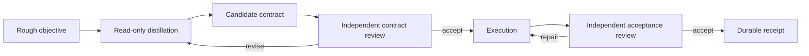

# Autonomous task protocol

`jeden pursue "<rough objective>"` turns an intent seed into a reviewed outcome contract, executes that contract, and refuses success until an independent read-only review can cite evidence for every acceptance criterion.

## Why this is separate from `run`

`jeden run` sends the supplied task directly into one agent conversation. That is appropriate when the task is already concrete. `pursue` is for an underspecified objective whose intended result, boundaries, and taste must be recovered from the repository and prior decisions before implementation starts.

The rough objective is preserved verbatim in the contract, but it is not the finish line. The approved acceptance criteria are.

## Invocation

```sh
jeden pursue "replace X with the product-specific result users need" \
  --cwd /path/to/repository \
  --allow-write \
  --allow-command
```

For a fully unattended run, the operator may use `--yolo` instead of the two grants. That authorizes Jeden's normal write and command tools; it does not bypass repository hooks, path jails, the contract review, or the acceptance review.

`--json` returns the run id and paths to the durable contract, verdict, and receipt.

## State machine



Contract review is bounded to three rounds. Execution and acceptance review are bounded to five rounds. Exhausting either bound produces a rejected receipt and a failing command; it never produces a successful-looking partial result.

## Contract

The canonical schema is [`protocol/schema/autonomy-contract-v1.schema.json`](../protocol/schema/autonomy-contract-v1.schema.json). A contract records:

- the intended user and observable outcome;
- the repository state and exact sources of truth read before implementation;
- constraints and explicit non-goals;
- disprovable acceptance criteria;
- conditions that reject an otherwise plausible implementation;
- the evidence required for each criterion;
- an ordered implementation plan.

Acceptance criteria describe outcomes and observations, not internal implementation steps. Each required evidence record points to one criterion and uses one of six bounded kinds: `source`, `configuration`, `manifest`, `history`, `product-output`, or `artifact`.

## Preference evidence

Before model work begins, Jeden writes `preference-evidence.json` from:

1. optional project and user profiles at `.jeden/autonomy-preferences.md` and `~/.jeden/autonomy-preferences.md`;
2. when command execution was explicitly granted, recent masked user and assistant events returned by Transcript Lake for up to six significant words from the rough objective.

`TRANSCRIPT_LAKE_BIN` may select the executable. Jeden invokes it only with `--allow-command` or `--yolo`; without that grant, or when the executable cannot return valid JSON, the evidence file records why Transcript Lake was unavailable instead of silently representing the result as an empty preference history.

Historical text is evidence of taste, not authority over repository facts. The contract stage must infer repeated accepted and rejected patterns, while current source, configuration, manifests, and product output remain authoritative.

## Review

Contract review uses a fresh read-only conversation. It rejects contracts that merely restate the objective, invent adjacent features, turn implementation details into outcomes, omit a material boundary, or provide criteria that cannot be disproved.

Acceptance review also uses a fresh read-only conversation and the canonical [`autonomy-verdict-v1.schema.json`](../protocol/schema/autonomy-verdict-v1.schema.json). It does not trust the executor's summary. An `accept` verdict requires:

- exactly one verdict row for every contract criterion;
- `passed: true` and non-empty evidence for every row;
- an empty gap for every row;
- no contradictions;
- no required repairs.

A rejected verdict is fed back to the same execution conversation so it can repair the existing implementation without losing context or widening the approved scope.

## Durable output

Every invocation writes one directory beneath `<cwd>/.jeden/autonomy/<run-id>/`:

```text
preference-evidence.json
contract-review-1.json
contract.json
execution-1.md
verdict-1.json
verdict.json
receipt.json
```

Additional review or repair rounds receive incrementing suffixes. `receipt.json` records every planner, execution, and reviewer session path, the terminal state, the number of execution rounds, and the canonical contract and verdict paths.

The terminal states are:

- `succeeded` — the final verdict satisfies every acceptance invariant;
- `contract_rejected` — no candidate contract passed the distillation gate;
- `rejected` — implementation exhausted the repair bound without satisfying the contract.

## Boundaries

- Distillation and both reviewers have read tools but no write or command grant.
- The executor receives only the grants supplied to `pursue`.
- Existing project hooks and extension context still apply to every model turn.
- Existing interactive mode state such as `/plan`, `/goal`, or `/loop` is not injected into protocol stages; the approved contract owns the run.
- The protocol does not perform an irreversible external action or spend money merely to make a criterion pass; such a criterion remains visibly unmet.
