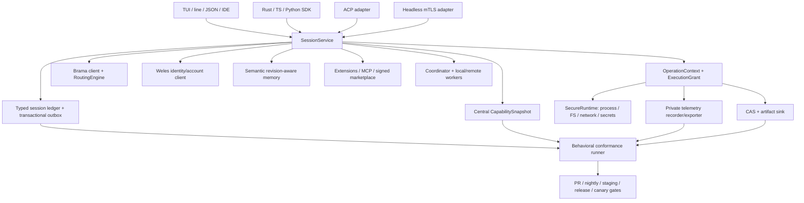
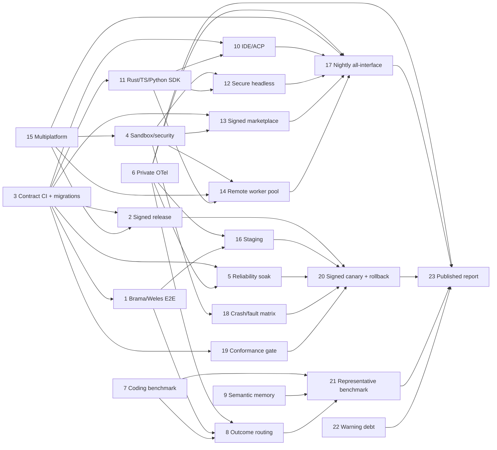

# Jeden Production Roadmap

<!-- Generated by `jeden roadmap render` from `roadmap/roadmap.yaml`. Do not edit by hand. -->

Schema version: `1` · Revision: `7` · Items: `25`

## Status legend

`backlog` · `planned` · `in_progress` · `implemented` · `not_run` · `failed` · `external_blocked` · `passed` · `dropped`

## Migrated production-program context

The preserved context below describes the original 23-scope certification program. The canonical item list that follows is versioned independently and may extend that original program.

## Summary

Po milestone 38/38 Jeden powinien wejść w program produkcyjnej certyfikacji, a nie w kolejną rundę dokładania niezależnych powierzchni. Program obejmuje dokładnie 23 osobne zakresy akceptacyjne, ale buduje je na ośmiu współdzielonych fundamentach: (A) centralnym `CapabilitySnapshot` z wiązaniem descriptor–handler–policy–health, (B) obowiązkowym `OperationContext` rozszerzonym o nieprzenoszalny grant bezpieczeństwa i telemetrykę, (C) wersjonowanym typed session ledgerze z transactional outbox, (D) wspólnych kontraktach Brama/Weles, (E) jednym publicznym `SessionService` i jednym wire protocol dla TUI/CLI/RPC/ACP/SDK/headless, (F) jednym behavioral conformance runnerze, (G) jednym trust/CAS/release substrate oraz (H) platform adapters dla macOS/Linux/Windows. Dzięki temu staging, nightly E2E, fault matrix, canary i końcowy raport są dowodami tych samych zachowań, a nie osobnymi implementacjami. Kod, kontrakty, migratory, fake services, fixture keys/certificates i local worker są implementowalne w repo; realne staging credentials, KMS/codesigning identities, publiczne registry, durable coordinator/CAS i natywne runner fleets są wyraźnie oznaczone jako prerequisites zewnętrzne.

---

## 1. Założenia, rozstrzygnięcia i stan wejściowy

### Założenia

1. Lista 23 zakresów jest normatywna i każdy zakres zachowuje osobną checklistę acceptance, nawet gdy kilka zakresów korzysta z tego samego fundamentu.
2. `docs/JEDEN_PRODUCT_COMPLETENESS.md` pozostaje kontraktem kompletności funkcjonalnej milestone 38/38. Nowy dokument opisuje program produkcyjny po tym milestone; nie duplikuje całej macierzy funkcji.
3. Brama pozostaje jedynym model control plane/gateway, a Weles jedynym identity/account control plane. Jeden nie implementuje provider-native OAuth ani własnego vaulta provider credentials.
4. Centralny registry pozostaje w `rust/capability/mod.rs`; nie tworzyć równoległych registry dla SDK, IDE, marketplace, workers ani telemetryki.
5. `OperationContext` z `rust/runtime_ops/mod.rs` pozostaje obowiązkową kopertą każdej aktywnej operacji. Rozszerzać go, nie tworzyć osobnych cancellation/deadline/output contracts.
6. Typed session ledger pozostaje źródłem semantycznego stanu. Obecny `LedgerEntry { version, id, parent_id, ts, kind, data }` wymaga migracji z `kind + Value` do zamkniętego enumu payloadów oraz atomicznego outboxa; nie tworzyć osobnego event store dla SDK, telemetryki, routing outcomes, workers ani collaboration.
7. Realne sekrety, identities i infrastruktura nigdy nie trafiają do fixture’ów. Testy lokalne używają efemerycznych kluczy, certyfikatów, scripted servers, local CAS i local worker transportu.
8. ACP oznacza konkretną, przypiętą wersję oficjalnego protokołu; obecny `RpcMode::Acp` nie może być przedstawiany jako pełne ACP, dopóki adapter nie przejdzie upstream vectors.

### Zweryfikowany stan wejściowy

- `rust/capability/mod.rs` ma atomowy, generacyjny registry (`CapabilitySnapshot`, `CapabilityDescriptor`, `FunctionTarget`, health i UI honesty), ale descriptor nie wiąże jeszcze niezmiennie input/output schema, handler identity, effective grant i evidence generation. Dispatch narzędzi nadal wchodzi przez stringowy `tool_runtime::execute`.
- `rust/runtime_ops/mod.rs` ma `CancellationToken`, `OperationContext`, `ArtifactSink`, `OutputLimits` i process manager, ale nie ma security principal/grant, sandbox health ani wspólnej telemetry policy; nie wszystkie MCP/LSP/TUI/memory/collab paths przyjmują ten context.
- Ledger ma wersję, ID, parent i active leaf oraz rozpoznaje uszkodzony środek/truncated tail, ale payload nadal jest `kind: String + serde_json::Value`. W `SessionRecorder::record` ledger append następuje przed synchronicznymi side-effectami memory/collab; retry po błędzie może zduplikować side effect. To należy zastąpić outboxem.
- `rust/control_plane/brama.rs` i `weles.rs` implementują realne klienty, katalog/provider/account lifecycle i scripted fixtures, ale brak pełnego staging readiness/version-skew/idempotency/Retry-After/degraded-cache contract.
- Updater w `rust/cli/run/slash.rs` sprawdza SHA-256 i HMAC oraz robi swap/health/rollback, lecz klient posiada sekret podpisujący; brak asymmetric trust, channel/target/expiry/anti-rollback/journal/recovery.
- Conformance ma 38 areas i UI honesty, lecz `rust/conformance/probes.rs` w większości dowodzi obecności symboli w źródłach, a nie zachowania.
- Rust `AgentSession` i NDJSON RPC istnieją; brak kanonicznego schema artifact, event cursor/replay, pełnego ACP, TS/Python SDK, mTLS headless i tenant isolation.
- Marketplace instaluje realne pluginy, ale katalog/artefakty nie mają public-key signatures, deterministic dependency resolver, lockfile, revocation i transakcyjnej wielopakietowej aktywacji.
- Task scheduler ma lokalny DAG, izolowane kopie/worktrees i recovery, lecz brak Worker/Attempt/Lease/fencing/heartbeat, CAS snapshotów i remote placement.
- Memory używa SQLite WAL + FTS5, ale `SemanticBackend` jest faktycznie lexical; brak embeddings, logical revisions, conflicts, temporal validity i outcome measurement.
- W repo nie ma `.github/workflows`, `benchmarks/**`, TS/Python SDK, OpenTelemetry, rzeczywistego OS sandboxa ani pełnego Windows adaptera.

---

## 2. Wspólna architektura docelowa

### 2.1 Publiczne kontrakty, które trzeba zamrozić przed pracą równoległą

#### `CapabilityDescriptorV2` — owner: Capability/Conformance

Docelowe pola: `id`, `version`, `kind`, `source`, `provenance`, `operations`, `dependencies`, `input_schema_id`, `output_schema_id`, `handler_id`, `requested_grants`, `effective_grants`, `health { state, checked_at, evidence_id }`, `generation`, `ui`. `CapabilitySnapshot` publikuje descriptor tylko wtedy, gdy handler, schemas, policy i health są spójne. In-flight operation pinuje generation. Nie wolno tworzyć SDK/IDE/worker capability list poza projekcją tego snapshotu.

#### `OperationContextV2` — owner: Runtime Security

`OperationContext { operation_id, session_id, turn_id, parent_operation_id, cancellation, deadline, progress, artifact_sink, output_limits, approval_handle, ledger_handle, trace_context, execution_grant }`.

`ExecutionGrant` jest konstruowany wyłącznie przez `PolicyEngine`; zawiera principal, root handles, FS/network/process/secret scopes, resource limits, platform sandbox requirement i expiry. Grant childa jest przecięciem parent ∩ capability ∩ approval ∩ platform policy. Serializacja grantu jest tylko opisem audytowym, nie authority.

#### `SessionEventV2` i outbox — owner: Session/Persistence

Zamknięty enum obejmuje co najmniej: message/content block, model attempt/route/retry/usage, tool call/result, approval, artifact, compaction/handoff/branch/checkpoint, memory mutation/recall, capability generation, worker job/attempt/lease/event, collaboration, interaction, telemetry reference i terminal outcome. Envelope: `event_id`, `session_id`, `parent_id`, `sequence`, `timestamp`, `causation_id`, `correlation_id`, `schema_version`, checksum.

Append zdarzenia oraz wpisy `OutboxItem { consumer, event_id, attempt, lease_until, state }` są jedną transakcją. Memory, collaboration, telemetry i remote replication konsumują idempotentnie outbox; błąd side-effectu nie zmienia udanego appendu w pozorny błąd całej operacji.

#### `BramaApiV1` / `WelesApiV1` — owner: Control Plane

- Brama: `health`, `capabilities`, `catalog(etag)`, `resolve(RouteRequest)`, `stream(ModelRequest)`, z `catalogRevision`, availability, modalities, limits, prices, fallback/promotion metadata, usage i normalized terminal errors.
- Weles: `providers`, `accounts`, `begin_login`, `poll_operation`, `submit_input`, `cancel_operation`, `refresh`, `logout`; każde mutujące żądanie ma idempotency key, operation expiry, cursor i correlation ID.
- Wspólne: negotiated schema range, readiness, timeout/Retry-After, stale/degraded semantics, max payload, typed error taxonomy i injected transport dla local fixtures. Authorization jest late-bound `SecretRef`; nigdy raw token w ledger/artifact/telemetry.

#### `jeden.session.v1` — owner: Protocol/SDK

Kanoniczne JSON Schema Draft 2020-12 w `protocol/schema/v1/**`. Każdy request ma `id`, `method`, `params`, `meta { protocolVersion, idempotencyKey, deadline, traceId }`; event ma `sessionId`, `streamId`, `sequence`, `eventId`, `requestId`, `kind`, `payload`; error ma `code`, `message`, `retryable`, `details`. `SessionService` jest jedyną implementacją lifecycle; Rust in-process, NDJSON, ACP i headless są adapterami.

#### `EvalCaseV1`, `RouteDecisionV1`, `RunOutcomeV1` — owner: Quality/Routing

`EvalCase`: fixture, prompt, allowed/required capabilities, budget, deterministic graders, expected artifacts, tags, seed, provenance/license. `RouteDecision`: eligible candidates, selected route, predicted quality/cost/latency, policy/catalog revision, cohort i reason codes. `RunOutcome`: dataset/code/policy/catalog digests, served route, terminal reason, grader evidence, tool stats, latency/tokens/cost, retries/failovers, memory reads/writes i hard violations.

#### `ReleaseManifestV2` — owner: Release Engineering

Canonical/DSSE-signed manifest: `schemaVersion`, `version`, `channel`, `targetTriple`, `artifactUrl`, `sha256`, `size`, `publishedAt`, `expiresAt`, `minimumVersion`, `keyId`, `provenanceRef`, `sbomRef`. Binarka zawiera public trust roots dla canary/stable, nie signing secret. Update transaction ma durable journal, lock, pre/post health, last-known-good i startup recovery.

#### `MarketplaceEnvelopeV1` / `PluginLockV1` — owner: Marketplace

Catalog sequence/expiry/signatures/revocations; release zawiera semver, digest, size, platforms, dependencies, features, capabilities i entrypoints. Deterministyczny resolver tworzy byte-stable lock. Aktywacja to verify → resolve → fetch CAS → stage all → sandbox initialize/health → atomic registry generation swap → teardown previous. Revoked package jest quarantined i znika z executable registry.

#### `WorkerProtocolV1` — owner: Distributed Runtime

Osobne `Job`, `Attempt`, `Lease`, `Worker`; hello/version/capability negotiation, placement record, monotonic fencing token, heartbeat, event sequence/replay, idempotent cancellation i CAS-backed inputs/outputs. Local worker używa dokładnie tej samej state machine przez in-process transport.

---

## 3. Dependency DAG i fale

### DAG zakresów

### Kolejność fal

#### Wave 0 — kontrakty i executable baseline

Zakres 3 rozpoczyna program: schema registry, migration runner, behavioral result format i fixture manifests. Równolegle przygotować local control-plane servers, legacy DB/config/session fixtures, local signing PKI, benchmark schema i adversarial corpora. Nie wymaga żadnych sekretów.

**Exit:** każda z 23 checklist ma machine-readable gate ID, ownera, fixture i ścieżkę artefaktu; CI potrafi odróżnić `not-run`, `failed`, `external-blocked` i `passed`, nigdy nie mapuje obecności symbolu na pass.

#### Wave 1 — wspólna production spine

Równolegle: 4 sandbox/security, 6 private telemetry, 15 platform adapters oraz migracyjna część 3. Integrator przepina wszystkie procesy/HTTP/FS na `OperationContextV2`; session owner dostarcza typed payload + outbox.

**Exit:** jeden local turn obejmujący model fixture, tool process, artifact spill, memory outbox i telemetry ma wspólne operation/session/trace IDs; cancel zabija descendants; żaden canary secret nie trafia do trwałego sinku.

#### Wave 2 — control plane, dystrybucja i publiczne API

Równolegle po kontraktach: 1 realne Brama/Weles E2E (najpierw local contract mode), 2 signed release engineering, 11 SDK protocol/core. Po `SessionService` i security: 12 secure headless. Ta fala dostarcza także release/migration infrastructure używaną później przez marketplace i canary.

**Exit:** released local artifact przechodzi self-test/rollback fixtures; te same session events są identyczne przez in-process Rust i NDJSON; Brama/Weles scripted contract suite pokrywa sukces, auth, 429, malformed, timeout, cancel i stale cache.

#### Wave 3 — jakość agenta

Zakresy 7 benchmark runner, 8 outcome-based routing i 9 semantic quality memory. Dataset i deterministic graders mogą powstać równolegle z memory schema v2/v3; routing zaczyna po stabilizacji `RunOutcomeV1` i Brama catalog revision.

**Exit:** pinned mini-suite reprodukuje decisions i grader scores; route selection reaguje na outcome/cost/capabilities bez naruszenia hard constraints; recall rozróżnia current/superseded/conflicting facts i publikuje evidence.

#### Wave 4 — IDE i ekosystem wykonywalny

Równolegle: 10 właściwy ACP/IDE adapter, 13 signed marketplace i fundament 14 CAS/worker protocol. Remote transport/placement zaczyna po local worker parity, security i platform adapterach.

**Exit:** oficjalny ACP fixture, signed plugin activation+rollback+revocation fixture oraz local/remote-loopback worker fixture przechodzą przez ten sam capability/operation/session substrate.

#### Wave 5 — zewnętrzny staging i cross-interface automation

16 uruchamia real Brama/Weles staging z OIDC/short-lived credentials. 17 składa nightly all-interface E2E na released canary artifact, nie na `cargo run`. Scope 5 uruchamia soak lanes od początku tej fali.

**Exit:** nightly wykonuje tę samą reprezentatywną sesję przez TUI PTY, line/JSON, Rust/TS/Python, ACP i headless; normalized ledger outcome jest równoważny.

#### Wave 6 — sprint certyfikacyjny

18 crash/fault matrix, 19 conformance CI gate i 20 signed canary+rollback. Fault tests są rozwijane wcześniej, lecz dopiero teraz stają się pełnym release gate. Canary promuje ten sam digest, nigdy rebuild.

**Exit:** wszystkie wymagane faults mają deterministic expected terminal outcome; pełny conformance report jest kompletny; bad canary automatycznie wraca do last-known-good.

#### Wave 7 — dowód jakości i publikacja

21 representative benchmark, 22 warning debt/deny warnings, 23 signed quality/reliability report. Benchmark używa predeclared manifestu i seeds; raport agreguje tylko immutable artifacts z poprzednich gates.

**Exit:** raport można odtworzyć z commit/tag, dataset/catalog/policy digests, test artifacts i release digest; brak ręcznych statusów.

---

---

## 5. Długotrwałe reliability tests

**Pliki/moduły:** `tests/soak/**`, `rust/test_support/fault_clock.rs`, workflow `soak.yml`, metrics reader korzystający z zakresu 6.

**Zmiana:** deterministic virtual-time stress w PR oraz real-time soak nightly: model streams, process trees, MCP reconnect, extension reload, sessions/outbox, memory leases, worker heartbeats, collaboration i updater recovery. Test nie może polegać tylko na braku panic; sprawdza invariants.

**Acceptance:**
- PR stress: co najmniej 1 000 mixed operations z fixed seed;
- nightly soak: 24 h lub 10 000 completed operations, zależnie co później;
- zero orphan process/lease/outbox item po grace, zero ledger lineage violation, zero duplicate terminal outcome, zero plaintext secret canary;
- bounded queues nie przekraczają descriptor limits; RSS growth slope po warm-up < 1 MiB/h w reference fixture, FD/process counts wracają do baseline;
- cancellation p99 ≤ 5 s dla lokalnych process/MCP/worker fixtures, chyba że platform descriptor jawnie deklaruje ostrzejszy limit.

**Zewnętrzne prerequisites:** dedicated long-lived runners i retention dla artifacts. Harness pozostaje lokalny.

### 6. Private OpenTelemetry

**Pliki/moduły:** nowy `rust/telemetry/{mod,schema,recorder,export,privacy}.rs`; integracja wyłącznie przez `OperationContext`; `rust/conformance/health.rs`; config schema.

**Zmiana:** traces/metrics/logs z operation/session/attempt/route/capability generation IDs; default local-only, bounded spool, explicit opt-in OTLP export; denylist danych: prompt/response, paths, repo/branch, command args, URLs/hosts/query, raw tool input/output i secret names. Osobny append-only security audit log z pseudonimizacją. Telemetry never blocks operation; loss publikuje typed health/error counter.

**Acceptance:** golden allowlist schema; opt-out = zero network requests; canary values w prompt/path/host/secret/tool args nie pojawiają się w spool/export; cancellation/retry/failover/worker spans zachowują parentage; bounded queue overflow ma policzalny drop counter; delete/retention działa.

**Zewnętrzne prerequisites:** prywatny OTLP collector, TLS trust i retencja/RBAC. Local file exporter i capture server wystarczą dla CI.

### 7. Coding-agent benchmark

**Pliki/moduły:** `rust/eval/{mod,dataset,runner,graders,metrics,report}.rs`; `benchmarks/schema/**`, `benchmarks/datasets/**`, `benchmarks/manifests/**`, `benchmarks/fixtures/**`; CLI `jeden eval` jako cienki adapter.

**Zmiana:** immutable `EvalCaseV1` i `RunOutcomeV1`; isolated HOME/session/memory/quality DB/workspace; deterministic process/file/artifact/schema graders pierwsze, model grader tylko wersjonowany i skalibrowany; canonical report z hashes. Unique key zapewnia resumability/idempotency.

**Acceptance:** schema/license/leak/duplicate checks; dwa reference runs dają identyczne routing decisions i deterministic grader scores; missing grader/catalog/artifact fail-closed; hard forbidden action zawsze fail; report zawiera dataset, fixture, grader, code, catalog i policy digests.

**Zewnętrzne prerequisites:** zatwierdzone licencje/proweniencja reprezentatywnego datasetu i ewentualny pinned model grader. PR suite używa scripted routera i nie wymaga quota.

### 8. Outcome-based routing

**Pliki/moduły:** nowy `rust/routing/{mod,policy,store,canary}.rs`; clean cutover w `rust/agent/runtime/routing.rs`, `rust/agent/conversation/turn.rs`, `rust/model_router.rs`, `rust/task_runtime/types.rs`; usage UI czyta agregaty z quality store zamiast osobnego zapisu.

**Zmiana:** eligibility (catalog/policy/capabilities/context/budget) → quality/cost/latency priors → constrained utility → sticky canary policy → immutable decision. Istniejący retry/fallback pozostaje reliability layer po route decision i nie fałszuje outcome kandydata. Każdy served route/fallback/retry ma ledger evidence.

**Acceptance:** hard capability/context/budget wyklucza niedozwolony model; cold start jest deterministyczny; outcomes aktualizują statystyki; sticky cohort nie zmienia się na retry; kill switch i guardrail rollback; shadow mode nie wykonuje user-visible side effects; fallback attribution trafia do faktycznie served route; calibration/utility metrics raportowane.

**Zewnętrzne prerequisites:** Brama catalog z trwałą route/provider identity, prices/limits/capabilities/catalog revision i rzeczywiście served route/usage; zatwierdzone weights/guardrails i stable non-PII subject key/salt.

### 9. Semantic quality memory

**Pliki/moduły:** podzielić `rust/memory/mod.rs` na `schema.rs`, `store.rs`, `ranking.rs`, `conflict.rs`, `embeddings.rs`, `worker.rs`; migration v1→v2/v3; integracja ledger outbox.

**Zmiana:** logical key/revision/validity/supersession/tombstone/decay; graph relations supports/conflicts/duplicates; embeddings jako derived rebuildable state; hybrid semantic + FTS5 + confidence + temporal score. Recall zwraca component scores, revisions, conflict groups i provenance. Decay nie mutuje faktów.

**Acceptance:** duplicate, supersession, simultaneous contradiction, resolution, half-life boundary, time-travel, global/repo scope, embedding revision rebuild, secret redaction; stale/superseded exact fixtures mają recall rate 0; unresolved conflict zwraca obie strony; migration zachowuje ID/FTS/provenance; Recall@k/MRR/nDCG i answer-lift są częścią benchmarku 21.

**Zewnętrzne prerequisites:** pinned embedding model/service lub jawnie wspierany local embedder z revision/dimensions/license. Bez niego health ma `lexical-only`, nigdy fałszywe `semantic`.

### 10. IDE/ACP integration

**Pliki/moduły:** zastąpić `rust/rpc/acp.rs` katalogiem `rust/rpc/acp/{mod,mapping,client_proxy}.rs`; `tests/acp/**`; IDE filesystem/terminal proxy przez capability grants.

**Zmiana:** implementacja przypiętej wersji ACP: initialize/capability negotiation, session new/load/prompt/cancel, session updates, content blocks, tool calls/status/results, plans, input/permission i teardown. Adapter mapuje exhaustively ACP ↔ `jeden.session.v1`; brak client capability zwraca typed unsupported.

**Acceptance:** upstream-compatible vectors/transcript; normalized event equivalence z in-process/NDJSON; pending input/approval accept/reject/timeout/cancel/reconnect bez leak; filesystem/terminal proxy respektuje grant; `RpcMode::Acp` faux alias usunięty.

**Zewnętrzne prerequisites:** zamrożona wersja oficjalnej specyfikacji i upstream conformance client/vectors; partner IDE do interoperability smoke.

### 11. Stable Rust/TypeScript/Python SDK

**Pliki/moduły:** wydzielić Cargo workspace/crates `crates/jeden-protocol`, `crates/jeden-sdk`; `packages/sdk-typescript/**`; `python/jeden-sdk/**`; generator z `protocol/schema/v1/**`; compatibility checker.

**Zmiana:** async client/session/prompt handle/events/result/cancel/reconnect/dispose; runtime validators w TS/Python; Rust in-process implementuje ten sam trait; semver/minimum runtime policy; generated wire types, handwritten ergonomic API.

**Acceptance:** golden JSON round-trip w 3 językach; create/open/prompt/events/cancel/reconnect/dispose przeciw temu samemu daemon fixture; same typed errors; unknown additive field działa, breaking schema diff blokuje CI; package examples kompilują/uruchamiają się; version matrix jest spójny.

**Zewnętrzne prerequisites:** zarezerwowane crate/npm/PyPI names, publisher identities i minimalne wspierane Rust/Node/Python. Local package/build tests nie wymagają publikacji.

### 12. Secure headless service

**Pliki/moduły:** `rust/rpc/{service,daemon,transport,tls,tenant,idempotency,replay}.rs`; `rust/main.rs` dodaje `daemon`; reuse `SessionService`.

**Zmiana:** TLS 1.3 + required client cert; principal z verified SAN, nie request tenant ID; tenant-scoped sessions/artifacts/idempotency/quotas/logs; durable event sequence/cursor/replay; reconnect token; bounded executor/backpressure; health/readiness/graceful drain; disconnect nie anuluje operacji automatycznie.

**Acceptance:** cert trust/expiry/wrong CA/no cert/reload/revocation; cross-tenant open/subscribe/cancel/artifact nie daje existence oracle; same idempotency key+digest reattach, inny digest conflict; restart podczas active/completed request; cursor overlap/gap/too-old; slow consumer nie niszczy promptu; exact one terminal event.

**Zewnętrzne prerequisites:** PKI/CA, SAN→principal→tenant policy w Weles, revocation/rotation, durable deployment storage i ingress. CI generuje ephemeral CA/certs.

### 13. Production signed marketplace

**Pliki/moduły:** nowy `rust/marketplace/{manifest,trust,resolver,lock,service}.rs`; migracja `rust/slash/plugins/{fetch,ops,registry,marketplace,mod}.rs`; `rust/extensions/mod.rs` konsumuje tylko verified active package handle; CAS z zakresu 14/2 trust primitives.

**Zmiana:** Ed25519 threshold trust roots, expiry/sequence/anti-freeze, artifact digest, semver dependency resolver, byte-stable lock, revocation/quarantine, transactional multi-package activation/rollback. `dev-link` to jawny lokalny tryb, nigdy marketplace fallback.

**Acceptance:** threshold, unknown/expired/revoked key, root rotation, catalog replay/substitution, tamper; diamond/conflict/cycle/features/platform resolver; stage crash/init failure rollback; revoked active plugin znika z registry i worker jest torn down; bytes nie wykonują się przed verify; installed ≠ active.

**Zewnętrzne prerequisites:** marketplace root custody/signing service, immutable catalog/revocation feed/artifact hosting, publisher enrollment i policy. Fixture catalogs/keys są repo-local.

### 14. Remote worker pool

**Pliki/moduły:** nowy `rust/cas/{digest,store,snapshot,gc}.rs`; rozbić `rust/task_runtime` na `protocol.rs`, `coordinator.rs`, `worker.rs`, `placement.rs`, `store.rs`; platform abstractions z 15; transport auth reuse z 12.

**Zmiana:** Job/Attempt/Lease/Worker, fencing/heartbeat/replay/cancel, Merkle workspace snapshots, immutable CAS, hard-constraint placement (OS/arch/capabilities/sandbox/resources/trust zone/residency), locality/load scoring. Local execution przechodzi przez tę samą state machine.

**Acceptance:** negotiate/reject version, mismatch no-placement, ack timeout, heartbeat loss/reassignment, stale fencing commit rejection, restart adoption, event replay no duplicates, cancellation na każdej fazie, output spill CAS, corrupt/resumed upload, snapshot determinism/symlink/case collision, placement residency; local i loopback-remote outcomes identyczne.

**Zewnętrzne prerequisites:** durable coordinator DB, object CAS/KMS, mTLS/SPIFFE enrollment, runner fleet, quotas/data residency/network policy. Repo dostarcza local filesystem CAS i loopback workers.

### 15. Multiplatform

**Pliki/moduły:** nowy `rust/platform/{mod,macos,linux,windows}.rs`; przenieść target semantics z `runtime_ops/{process,pty,kernel}.rs`, `task_runtime/workspace.rs`, updater i temp/filesystem paths.

**Zmiana:** `ProcessPlatform`, `PtyPlatform`, `WorkspacePlatform`, `AtomicFsPlatform`, `DesktopPlatform`. macOS: process groups/APFS/openpty; Linux: process groups/reflink/openpty/cgroup integration; Windows: Job Object/ConPTY/CreateProcess quoting/ReplaceFileW/secure ACL temp. `Unsupported` jest jawne; żadnych non-Unix no-op success.

**Acceptance:** compile dla targetów plus native runtime matrix: descendant cleanup, Unicode/spaces argv/env, deadline/cancel, atomic replace/rollback, secure temp mode/ACL, PTY spawn/resize/paste/EOF, snapshot/materialize/capture/merge; capability health odzwierciedla adapter rzeczywiście dostępny.

**Zewnętrzne prerequisites:** native macOS arm64/x64, Linux x64/arm64 i Windows x64 runners, filesystem variants oraz signing toolchains.

### 16. Staging Brama/Weles

**Pliki/moduły:** `.github/workflows/staging-e2e.yml`, `tests/staging/**`, deployment/environment descriptors; reuse exact clients/harness z 1, telemetry z 6 i released artifact z 2.

**Zmiana:** workload OIDC pobiera short-lived identity; test bootuje canary artifact, wykonuje doctor, Weles disposable lifecycle, Brama catalog/resolve/stream, session restart/migration i secret scan. Żadnej osobnej staging code path.

**Acceptance:** machine report zawiera release digest, control-plane schema/catalog revisions, request/operation IDs i redacted trace refs; brak static secret; cleanup konta/sesji niezależnie od wyniku; 429/degraded test jest jawnie kontrolowany; failure blokuje canary promotion.

**Zewnętrzne prerequisites:** environments/roles/endpoints/quota/DNS/TLS/disposable tenant. Bez nich lokalny contract gate nadal działa, staging gate raportuje konkretnie brakujący prerequisite.

### 17. Nightly all-interface E2E

**Pliki/moduły:** `.github/workflows/nightly-e2e.yml`, `tests/e2e/interfaces/**`, shared scenario manifest.

**Zmiana:** jedna reprezentatywna sesja (prompt, tool, approval, artifact, memory, cancel/reconnect/resume) uruchamiana przez TUI PTY, line, JSON/NDJSON, Rust SDK, TS SDK, Python SDK, ACP i mTLS headless. Normalizer usuwa wyłącznie transport metadata; semantic ledger musi być równoważny.

**Acceptance:** każde interface emituje ten sam ordered semantic event set i terminal outcome; non-TTY stdout bez ANSI/log noise; approval/cancel działa; restart/replay bez gap; artifact digests identyczne; capability snapshot generation zgodna.

**Zewnętrzne prerequisites:** native runners, IDE/ACP client fixture, staging credentials tylko dla online variant; offline nightly działa na scripted services.

### 18. Crash/fault matrix

**Pliki/moduły:** `tests/fault/**`, shared failpoint framework; failpoints w ledger/outbox, migrations, updater, MCP, extensions, workers, CAS, memory, headless i control plane.

**Zmiana:** deterministic named failpoints, fake clock/network/disk; canonical matrix mapuje subsystem × phase × expected recovery. Nie akceptować „process exited nonzero” jako jedynego dowodu.

**Acceptance:** torn ledger/outbox, ENOSPC/EIO/EINTR, process kill, malformed stream, dropped MCP, extension crash loop, stale lease, coordinator/client restart, CAS corruption, migration/update interruption, TLS rotation i collab duplicate/reorder; po restart każdy przypadek ma exactly one terminal classification, preserved evidence, no orphan authority/process i jawny recovery/quarantine.

**Zewnętrzne prerequisites:** fault-capable runners/containers dla niektórych OS faults. Większość przez injected stores/transports jest lokalna.

### 19. Conformance CI gate

**Pliki/moduły:** przebudować `rust/conformance/{mod,probes,areas}.rs`; `tests/conformance/**`; `.github/workflows/ci.yml` i release workflows.

**Zmiana:** `BehaviorCheckResult` zawiera check version, fixture digest, command/scenario ID, timestamps, attempts, evidence artifact digest i protocol version. Registry dostarcza executable check handlers. Source scanning nie ustawia `complete=true`. UI honesty sprawdza descriptor→handler→health→surface.

**Acceptance:** negative fixture z obecnym symbolem, ale zepsutym behavior musi fail; missing/stale evidence fail; wszystkie 38 product areas i 23 production scopes mają check IDs; canonical report deterministic; PR smoke, nightly full i release profiles jawnie różnią coverage, lecz release wymaga pełnego profilu.

**Zewnętrzne prerequisites:** branch protection wymuszające gate i artifact retention/signing. Runner jest kodem repo.

### 20. Signed canary + rollback

**Pliki/moduły:** `.github/workflows/promote.yml`, channel manifest publisher, updater/recovery z 2, staging/soak/conformance consumers.

**Zmiana:** release budowany raz; canary manifest podpisany canary key; sticky cohort/explicit channel; health/error budget monitor; kill switch; rollback publikuje nowy signed channel pointer lub lokalnie aktywuje last-known-good; stable re-signuje/promuje ten sam digest po gates.

**Acceptance:** bad signature/health block; induced bad canary rollback w ≤5 min od alert fixture; clients po crash recovery mają old/new complete binary; anti-downgrade; canary/stable artifact SHA identyczny; promotion log zawiera approvals i all gate artifact digests.

**Zewnętrzne prerequisites:** channel store, KMS keys, monitoring/alerting, promotion authority i uzgodniony soak/error budget.

### 21. Representative benchmark run

**Pliki/moduły:** pinned manifest w `benchmarks/manifests/release-*.json`, workflow `benchmark-release.yml`, canonical report/signature.

**Zmiana:** held-out representative split, predeclared seeds/routes/budgets/graders/catalog snapshot/policy revision; paired baseline vs candidate; memory-enabled/disabled and routing alternatives tam, gdzie koszt na to pozwala.

**Acceptance:** zero hard/secret violations; lower bound 95% paired CI task success nie gorszy od pinned baseline o więcej niż 2 pp; p95 latency ≤110% baseline i koszt/success w zadeklarowanym budget; route regret/calibration raportowane; memory stale/superseded recall = 0 na exact temporal fixtures, conflict fixtures poprawne; wszystkie missing data oznaczają fail, nie zero.

**Zewnętrzne prerequisites:** zatwierdzony dataset, quota/cost budget, pinned catalog/model availability i product/risk sign-off dla progów. Offline mini benchmark pozostaje merge gate.

### 22. Warning debt + `deny(warnings)`

**Pliki/moduły:** `Cargo.toml`, crate roots, CI; TS/Python lint/type configs. Najpierw usunąć fakt, że library target przez `rust/lib.rs` wciąga binarny `main.rs`, co generuje dead-code warnings; wydzielić czyste crate boundaries.

**Zmiana:** warning inventory z ownerem; naprawić, nie blanket-allow. `-D warnings` dla wszystkich features/targets testowanych natywnie; rustdoc warnings; generated code ma osobny, uzasadniony policy. TS strict/noEmit i Python strict type/lint gate.

**Acceptance:** zero warnings dla debug/release, lib/bin/tests/examples, supported target compile matrix i rustdoc; brak repo-wide `allow(dead_code|unused|warnings)` poza generated module z komentarzem generatora; nowy warning blokuje PR.

**Zewnętrzne prerequisites:** native toolchains/runners i pinned compiler versions.

### 23. Publikacja quality/reliability report

**Pliki/moduły:** `rust/report/{mod,aggregate,sign}.rs` albo `xtask report`; `docs/reports/` tylko dla redacted human summary; canonical machine artifact pozostaje immutable release asset.

**Zmiana:** agregator czyta wyłącznie signed/canonical outputs zakresów 1–22: release/provenance, migrations, sandbox audit, soak, telemetry privacy, benchmark, SDK/interface parity, marketplace, workers, platform, staging/nightly, faults, conformance, canary i warnings. Każda metryka ma numerator/denominator, environment, revision i evidence link/digest. Brak ręcznych „passed”.

**Acceptance:** reproducible regeneration daje byte-identical canonical JSON; signature weryfikuje public root; human Markdown jest generowany; redaction scan zero canary secrets/paths/hosts; report jawnie wymienia `external-blocked` prerequisites i nie nazywa ich pass; tag/release/dataset/catalog/policy/artifact digests są spójne.

**Zewnętrzne prerequisites:** public/internal artifact publication location, report signing identity i zatwierdzona disclosure/privacy policy.

---

## 5. File ownership i równoległe workstreamy

| Workstream | Wyłączna własność | Konsumowane kontrakty | Nie powinien edytować |
|---|---|---|---|
| Capability/Conformance | `rust/capability/**`, `rust/conformance/**`, `tests/conformance/**` | handler/schema/health evidence | domenowych handlerów |
| Session/Persistence | ledger/store/outbox, `rust/cli/sessions.rs`, migracje sesji | `SessionEventV2` | SDK transports, telemetry exporters |
| Runtime Security/Platform | `rust/runtime_ops/**`, `rust/platform/**`, jail/network/secrets | `OperationContextV2`, `ExecutionGrant` | marketplace resolver, SDK wire |
| Control Plane | `rust/control_plane/**`, control-plane fixtures | `BramaApiV1`, `WelesApiV1` | routing policy, UI |
| Release/Migrations | `rust/update/**`, `.github/workflows/release*`, release schemas | platform atomic FS, conformance artifacts | marketplace trust logic poza wspólnym crypto crate |
| Protocol/SDK | `protocol/schema/**`, crates SDK/protocol, TS/Python packages | `SessionService` | runtime agent loop |
| Headless/ACP | `rust/rpc/**`, ACP fixtures | SDK wire, security/tenant policy | canonical wire schemas bez protocol-owner review |
| Quality/Routing | `rust/eval/**`, `rust/routing/**`, `benchmarks/**` | Brama catalog, ledger, telemetry | memory storage internals |
| Memory | `rust/memory/**` | ledger outbox, embedding port | routing store |
| Marketplace | `rust/marketplace/**`, `rust/slash/plugins/**` | common trust/CAS, capability activation | extension host internals poza narrow activation seam |
| Workers/CAS | `rust/cas/**`, `rust/task_runtime/**` | platform/security/SDK protocol | marketplace state |
| Certification | `tests/soak/**`, `tests/fault/**`, `tests/e2e/**`, `tests/staging/**`, nightly/promote/report workflows | wszystkie publiczne kontrakty | produkcyjny runtime poza named failpoints |

Wspólne seam files (`Cargo.toml`, `rust/lib.rs`, `rust/main.rs`, `rust/agent/conversation/turn.rs`) mają jednego integratora na falę. Domenowi ownerzy eksportują API; nie edytują tych plików równolegle.

---

## 6. Migracja i clean cutover

1. **Session ledger v1→v2:** transakcyjnie mapować known `kind + Value` do enumu; unknown zachować jako `ImportedLegacyEvent` tylko audytowo; malformed middle blokuje, truncated final ma jawny recovery record; source digest i marker idempotency. Dodać outbox bez synchronicznego wywoływania memory/collab z `record`.
2. **Config:** dodać `schemaVersion`; unknown/secret plaintext fields są diagnostyką; temp+fsync+rename+backup. Endpoints i secret refs rozdzielone.
3. **Memory v1→v2/v3:** zachować IDs/provenance/FTS; dodać revisions/edges/validity, potem embeddings. Embeddings są rebuildable i nie blokują downgrade danych autorytatywnych w compatibility window.
4. **Collab/job/worker/quality DB:** jawne SQLite `user_version`/metadata, transactional steps, refusal future schema.
5. **Updater v1→v2:** po wdrożeniu public trust roots usunąć `JEDEN_UPDATE_SIGNING_KEY` i HMAC path; brak równoległego compatibility fallbacku. Jednorazowy v1 klient nie może publikować v2 jako verified.
6. **SDK/RPC:** obecne NDJSON mapować do `jeden.session.v1`; ACP faux mode usunąć po gotowym adapterze. Breaking public API dopiero przed oznaczeniem 1.0; potem semver/schema compatibility gate.
7. **Marketplace:** stary registry importować jako desired-but-unverified; ponownie hashować i wymagać jawnego `dev-link` albo verified catalog release. Nie oznaczać legacy package jako active automatycznie.
8. **Task scheduler:** terminal legacy jobs zachować jako read-only history; running legacy po migracji = `Interrupted`; nowe jobs dzielić na Job/Attempt/Lease.
9. **Platform:** core przestaje mieć Unix/no-op branches dopiero po parity adapterów; unsupported capability jest disabled z typed reason.

---

## 7. Security i release model

- Trust roots rozdzielone: release canary, release stable, marketplace root/publisher. Żaden klient nie posiada private signing key.
- Secrets są `SecretRef`, materializowane late-bound wyłącznie do approved sink; redactor/skaner obejmuje każdy persistence/outbound sink.
- Plugin, MCP, eval i worker są untrusted principals nawet po poprawnym podpisie; podpis dowodzi pochodzenia, nie bezpieczeństwa.
- Stable jest promocją niezmiennego canary digest po staging, soak, fault, conformance i benchmark gates.
- Rollback binarki jest dozwolony tylko w zadeklarowanym data compatibility window; inaczej updater odmawia i wymaga forward repair.
- Wszystkie release/report/conformance artifacts zawierają source SHA, target, schema versions i digests; missing evidence fail-closed.

---

## 8. Edge Cases i pułapki

1. Cancel/completion race: dokładnie jeden terminal event; późne delty są odrzucane, ale zachowane jako diagnostic evidence.
2. Ledger append + memory/collab failure: append pozostaje sukcesem, outbox retry jest idempotentny; caller nie powtarza semantycznego zdarzenia.
3. Registry rebuild failure/cwd mismatch: nie wolno po cichu zwrócić snapshotu innego cwd; snapshot ma jawny stan `fresh`, `stale` albo `failed` oraz generation/evidence.
4. Route retry po visible output lub mutating tool: brak automatycznego replay side effectu; nowy attempt tylko z typed boundary.
5. Weles cancel vs complete i cursor replay: idempotent terminal operation, zero podwójnego account mutation.
6. SDK reconnect: sequence monotonic, event dedupe, `cursor_too_old` daje snapshot path; slow subscriber nie psuje promptu.
7. Sandbox degraded/unavailable: untrusted executable descriptor jest non-executable; approval nie zmienia braku technicznej izolacji w sukces.
8. Symlink/hardlink/mount/case collisions: snapshot/jail operują na handles i jawnej policy; nie canonicalize-then-open.
9. Marketplace root rotation/revocation: revoked aktywny plugin jest quarantined nawet offline po znanej revocation; freeze/rollback katalogu fail-closed.
10. Worker stale lease: fencing token uniemożliwia commit starego workera po reassignment.
11. Windows: quoting, Job Object, ConPTY, ACL i atomic replacement muszą być runtime-tested, nie tylko cross-compiled.
12. Telemetry cardinality/privacy: paths, model prompts, URLs i IDs użytkownika nie stają się labels; install/session IDs są rotowane/pseudonimizowane zgodnie z policy.
13. Benchmark nondeterminism: model/provider nondeterminism jest raportowany przez seeds/CI, deterministic graders pozostają reproducible; brak danych nie jest zerem.
14. Canary fallback: sukces fallbacku nie jest przypisany testowanemu kandydatowi.
15. Report freshness: report odrzuca artifacts z innym source SHA/release digest/schema lub przekroczoną ważnością.

---

## 9. Verification — profile gate’ów

### PR profile

- schema compatibility/generation checks;
- unit + local scripted contract suites Brama/Weles;
- migration smoke N-1/N/current/future;
- sandbox adversarial smoke na dostępnej platformie;
- deterministic mini benchmark i routing/memory fixtures;
- Rust/TS/Python protocol round-trip;
- updater/marketplace local test keys;
- local worker/CAS fixture;
- behavioral conformance smoke i negative-symbol fixture;
- zero warnings.

### Nightly profile

- pełna native platform matrix;
- all-interface E2E;
- 24 h/10k reliability soak;
- fuzz/sanitizers i pełny fault subset;
- full SDK package examples;
- marketplace/worker reconnect/restart suites;
- telemetry privacy scan.

### Staging/release profile

- released canary artifact przeciw real Brama/Weles staging;
- full migrations from every supported version;
- full fault matrix i behavioral conformance;
- SBOM/provenance/signature verification;
- representative benchmark z pinned manifestem;
- signed canary deployment, soak/guardrails i rollback drill;
- stable promotion tego samego digest;
- signed quality/reliability report.

---

## 10. Critical Files

Implementer powinien przeczytać przed rozpoczęciem:

1. `docs/JEDEN_PRODUCT_COMPLETENESS.md` — kompletność milestone 38/38, obecny target architecture i 38 product areas.
2. `rust/capability/mod.rs` — centralny registry, generations, `CapabilityDescriptor`, `FunctionTarget`, health/UI honesty.
3. `rust/runtime_ops/{mod,process,output,pty,kernel}.rs` — `OperationContext`, cancellation, process ownership i artifact/output bounds.
4. `rust/cli/sessions.rs` i `rust/agent/runtime/recorder.rs` — `LedgerEntry`, active leaf, recovery, append i obecny memory/collab side-effect order.
5. `rust/control_plane/{mod,brama,weles,tests}.rs` — aktualne Brama/Weles DTO, cache/lifecycle i reusable scripted server.
6. `rust/model_router.rs`, `rust/agent/runtime/routing.rs`, `rust/agent/conversation/turn.rs` — normalized stream/retry/failover, model selection i route usage.
7. `rust/sdk/{types,session}.rs`, `rust/rpc/{server,acp}.rs` — obecny AgentSession, NDJSON, bounded subscriptions i faux-ACP boundary.
8. `rust/conformance/{areas,probes,mod,health}.rs` — 38 areas, source-based evidence, UI honesty i doctor.
9. `rust/cli/run/slash.rs` — updater v1 HMAC/checksum/swap/health/rollback.
10. `rust/extensions/{mod,declarative,host.mjs,tests}.rs`, `rust/mcp/{mod,client}.rs` — activation/ABI/lifecycle i sandbox trust boundary.
11. `rust/slash/plugins/{fetch,ops,registry,marketplace,mod}.rs` — unsigned marketplace i activation persistence.
12. `rust/task_runtime/{types,scheduler,workspace,mailbox}.rs` — local scheduler, JobRecord, isolation i recovery.
13. `rust/memory/mod.rs` — SQLite WAL/FTS5 schema, leases, recall i current `SemanticBackend`.
14. `rust/context/{mod,secrets}.rs`, `rust/tool_runtime/shared.rs`, `rust/tool_services/{web,ssh}.rs` — secret policy, jail i egress boundaries.
15. `Cargo.toml`, `package.json`, `rust/lib.rs`, `rust/main.rs` — crate/package/API composition i obecny brak workspace/release automation.

---

## Definition of Done całego programu

Program jest ukończony dopiero, gdy wszystkie 23 checklisty mają behavioral evidence przypięte do jednego release digest; wszystkie implementowalne lokalnie kontrakty, migratory, fake services, fixture keys/certs, local CAS/workers i fault injectors są w repo; każdy brakujący element zewnętrzny jest maszynowo raportowany jako konkretny prerequisite, nie jako pass; canary przeszedł staging/soak/fault/conformance/benchmark i został wypromowany bez rebuildu; końcowy podpisany raport jest odtwarzalny i nie zawiera sekretów ani ręcznie deklarowanych statusów.

## JED-001. Realne Brama/Weles E2E

- **Area:** `control-plane`
- **Priority:** `P1`
- **Status:** `not_run`
- **Summary:** wstrzykiwany transport; schema negotiation, readiness, correlation/idempotency, Retry-After, timeout/cancel, degraded stale snapshot, Weles operation expiry/cursor/input; jeden fixture server używany przez PR i staging adapter. Każda zmiana konta invaliduje odpowiednią generację katalogu Brama. Authorization przechodzi przez `SecretRef` i outbound policy.
- **Depends on:** JED-003
- **External prerequisites:**
  - staging URLs, disposable tenant/account, OIDC audience/role, harmless model quota i supportowany schema/version window. Brak credentials nie blokuje implementacji ani local gate; oznacza tylko `external-blocked` dla staging gate.

### Files and modules

rozszerzyć `rust/control_plane/{brama,weles,tests}.rs`; dodać `rust/control_plane/{transport,contract,staging}.rs`, `tests/control_plane/**`, `fixtures/control_plane/**`.

### Acceptance criteria

- [ ] **acceptance-1** — scripted cases 200/304/401/403/409/429/5xx, malformed/oversize, delayed first event, idle timeout i cancellation
- [ ] **acceptance-2** — pełny Weles begin→poll→elicit→complete, refresh, logout i cancel race
- [ ] **acceptance-3** — Brama catalog resolve + harmless normalized stream z rzeczywiście served route/usage
- [ ] **acceptance-4** — zero bearer/token canary w ledger, artifact, error i telemetry capture
- [ ] **acceptance-5** — staging wariant emituje podpisany `control-plane-e2e.json` z endpoint identity, schema revisions i request IDs.

## JED-002. Podpisany release engineering

- **Area:** `release`
- **Priority:** `P1`
- **Status:** `not_run`
- **Summary:** HMAC v1 → Ed25519/public trust root + DSSE/canonical payload; target/channel/expiry/anti-rollback; journaled stage/activate/recover/rollback; SBOM i SLSA-style provenance; immutable artifacts. Stable to promocja identycznego canary digest.
- **Depends on:** JED-003, JED-015
- **External prerequisites:**
  - KMS/HSM signing identity, OIDC federation, artifact/manifest store, macOS Developer ID/notarization i Windows signing identity dla shipowanych targetów. Lokalne fixture’y używają efemerycznych test keys.

### Files and modules

nowy `rust/update/{mod,manifest,verify,download,transaction,recovery}.rs`; `rust/cli/run/slash.rs` zostaje cienkim dispatch; dodać `xtask/` albo `rust/release/`, `release/schema/**`, `.github/workflows/release.yml`, `promote.yml`.

### Acceptance criteria

- [ ] **acceptance-1** — valid/invalid key, tamper, wrong target/channel, checksum/size, expired/future, downgrade i unsupported schema
- [ ] **acceptance-2** — crash injection przed/po każdym fsync/rename
- [ ] **acceptance-3** — zawsze old albo new executable, nigdy partial
- [ ] **acceptance-4** — pre/post doctor failure przywraca previous
- [ ] **acceptance-5** — concurrent updater lock
- [ ] **acceptance-6** — manifest/SBOM/provenance digests zgodne z artifactem

## JED-003. Kontraktowe CI i migracje

- **Area:** `migrations`
- **Priority:** `P0`
- **Status:** `not_run`
- **Summary:** wspólny `MigrationPlan { store, from, to, reversible, preflight, steps, compatibility_window }`; temp/backup/fsync/atomic commit; future-version refusal; canonical gate artifact. Conformance `BehaviorProbe` uruchamia fixture lub konsumuje signed test result, a source probes zostają co najwyżej inventory sanity checks.
- **External prerequisites:**
  - hostowany CI i branch protection. Cały migration runner i fixture matrix są lokalne.

### Files and modules

`.github/workflows/ci.yml`; nowy `rust/migrations/{mod,plan,journal}.rs`; adaptery w `rust/cli/config/mod.rs`, `rust/cli/sessions.rs`, `rust/memory/mod.rs`, `rust/collab/relay.rs`, `rust/task_runtime/*`; `tests/migrations/**`; `rust/conformance/**`.

### Acceptance criteria

- [ ] **acceptance-1** — N-2/N-1/N/future dla config, session ledger, memory SQLite, collab SQLite, job/worker store, plugin lock i quality DB
- [ ] **acceptance-2** — repeat idempotency
- [ ] **acceptance-3** — crash na każdym kroku
- [ ] **acceptance-4** — corrupted/truncated input
- [ ] **acceptance-5** — backup restore
- [ ] **acceptance-6** — binary rollback compatibility
- [ ] **acceptance-7** — PR CI bez sekretów uruchamia schema, migrations, unit/contract i behavioral conformance smoke

## JED-004. Sandbox i security audit

- **Area:** `security`
- **Priority:** `P0`
- **Status:** `not_run`
- **Summary:** `SecureRuntime` + `ExecutionGrant`; fd-relative jail odporny na symlink/TOCTOU; default-deny egress z DNS/redirect revalidation; env_clear/FD closure/resource limits; child grant intersection; centralny secret broker dla model/network/process/artifact/transcript/export/share/telemetry/log. `CapabilityPolicy::Sandboxed` jest executable tylko przy `SandboxHealth::Enforced`.
- **Depends on:** JED-015
- **External prerequisites:**
  - decyzja o podpisanym macOS sandbox helperze/entitlements (deprecated `sandbox-exec` tylko dev interim), Linux runners z namespaces/Landlock/seccomp/cgroup v2, Windows runners z Job Objects/restricted token/AppContainer policy, system keychain/secret-service integration.

### Files and modules

rozszerzyć `rust/runtime_ops/mod.rs`; dodać `rust/runtime_ops/{security,fs,network,secrets}.rs`, `rust/runtime_ops/sandbox/{mod,macos,linux,windows}.rs`; przepiąć `process.rs`, `pty.rs`, `kernel.rs`, `mcp/client.rs`, `extensions/host.mjs`, `task_runtime`, `tool_services/{web,ssh}.rs`, `tool_runtime/shared.rs`.

### Acceptance criteria

- [ ] **acceptance-1** — attack fixtures na symlink swap, outside HOME/SSH key, env/agent socket, fork bomb, CPU/RSS/PID/FD/file flood, SSRF/DNS rebinding/metadata IP, plugin `node:fs/net/child_process`, Python/Node eval escape, MCP malformed/flood, hostile SSH
- [ ] **acceptance-2** — zero outside side effects, pełny descendant reap
- [ ] **acceptance-3** — fuzz corpora dla jail/grants/protocols/secrets

## JED-005. Długotrwałe reliability tests

- **Area:** `reliability`
- **Priority:** `P1`
- **Status:** `not_run`
- **Summary:** deterministic virtual-time stress w PR oraz real-time soak nightly: model streams, process trees, MCP reconnect, extension reload, sessions/outbox, memory leases, worker heartbeats, collaboration i updater recovery. Test nie może polegać tylko na braku panic; sprawdza invariants.
- **Depends on:** JED-003, JED-006
- **External prerequisites:**
  - dedicated long-lived runners i retention dla artifacts. Harness pozostaje lokalny.

### Files and modules

`tests/soak/**`, `rust/test_support/fault_clock.rs`, workflow `soak.yml`, metrics reader korzystający z zakresu 6.

### Acceptance criteria

- [ ] **acceptance-1** — PR stress: co najmniej 1 000 mixed operations z fixed seed
- [ ] **acceptance-2** — nightly soak: 24 h lub 10 000 completed operations, zależnie co później
- [ ] **acceptance-3** — zero orphan process/lease/outbox item po grace, zero ledger lineage violation, zero duplicate terminal outcome, zero plaintext secret canary
- [ ] **acceptance-4** — bounded queues nie przekraczają descriptor limits; RSS growth slope po warm-up < 1 MiB/h w reference fixture, FD/process counts wracają do baseline
- [ ] **acceptance-5** — cancellation p99 ≤ 5 s dla lokalnych process/MCP/worker fixtures, chyba że platform descriptor jawnie deklaruje ostrzejszy limit.

## JED-006. Private OpenTelemetry

- **Area:** `telemetry`
- **Priority:** `P0`
- **Status:** `not_run`
- **Summary:** traces/metrics/logs z operation/session/attempt/route/capability generation IDs; default local-only, bounded spool, explicit opt-in OTLP export; denylist danych: prompt/response, paths, repo/branch, command args, URLs/hosts/query, raw tool input/output i secret names. Osobny append-only security audit log z pseudonimizacją. Telemetry never blocks operation; loss publikuje typed health/error counter.
- **External prerequisites:**
  - prywatny OTLP collector, TLS trust i retencja/RBAC. Local file exporter i capture server wystarczą dla CI.

### Files and modules

nowy `rust/telemetry/{mod,schema,recorder,export,privacy}.rs`; integracja wyłącznie przez `OperationContext`; `rust/conformance/health.rs`; config schema.

### Acceptance criteria

- [ ] **acceptance-1** — golden allowlist schema
- [ ] **acceptance-2** — opt-out = zero network requests
- [ ] **acceptance-3** — canary values w prompt/path/host/secret/tool args nie pojawiają się w spool/export
- [ ] **acceptance-4** — cancellation/retry/failover/worker spans zachowują parentage
- [ ] **acceptance-5** — bounded queue overflow ma policzalny drop counter
- [ ] **acceptance-6** — delete/retention działa

## JED-007. Coding-agent benchmark

- **Area:** `evaluation`
- **Priority:** `P1`
- **Status:** `not_run`
- **Summary:** immutable `EvalCaseV1` i `RunOutcomeV1`; isolated HOME/session/memory/quality DB/workspace; deterministic process/file/artifact/schema graders pierwsze, model grader tylko wersjonowany i skalibrowany; canonical report z hashes. Unique key zapewnia resumability/idempotency.
- **External prerequisites:**
  - zatwierdzone licencje/proweniencja reprezentatywnego datasetu i ewentualny pinned model grader. PR suite używa scripted routera i nie wymaga quota.

### Files and modules

`rust/eval/{mod,dataset,runner,graders,metrics,report}.rs`; `benchmarks/schema/**`, `benchmarks/datasets/**`, `benchmarks/manifests/**`, `benchmarks/fixtures/**`; CLI `jeden eval` jako cienki adapter.

### Acceptance criteria

- [ ] **acceptance-1** — schema/license/leak/duplicate checks
- [ ] **acceptance-2** — dwa reference runs dają identyczne routing decisions i deterministic grader scores
- [ ] **acceptance-3** — missing grader/catalog/artifact fail-closed
- [ ] **acceptance-4** — hard forbidden action zawsze fail
- [ ] **acceptance-5** — report zawiera dataset, fixture, grader, code, catalog i policy digests

## JED-008. Outcome-based routing

- **Area:** `routing`
- **Priority:** `P1`
- **Status:** `not_run`
- **Summary:** eligibility (catalog/policy/capabilities/context/budget) → quality/cost/latency priors → constrained utility → sticky canary policy → immutable decision. Istniejący retry/fallback pozostaje reliability layer po route decision i nie fałszuje outcome kandydata. Każdy served route/fallback/retry ma ledger evidence.
- **Depends on:** JED-001, JED-006, JED-007
- **External prerequisites:**
  - Brama catalog z trwałą route/provider identity, prices/limits/capabilities/catalog revision i rzeczywiście served route/usage; zatwierdzone weights/guardrails i stable non-PII subject key/salt.

### Files and modules

nowy `rust/routing/{mod,policy,store,canary}.rs`; clean cutover w `rust/agent/runtime/routing.rs`, `rust/agent/conversation/turn.rs`, `rust/model_router.rs`, `rust/task_runtime/types.rs`; usage UI czyta agregaty z quality store zamiast osobnego zapisu.

### Acceptance criteria

- [ ] **acceptance-1** — hard capability/context/budget wyklucza niedozwolony model
- [ ] **acceptance-2** — cold start jest deterministyczny
- [ ] **acceptance-3** — outcomes aktualizują statystyki
- [ ] **acceptance-4** — sticky cohort nie zmienia się na retry
- [ ] **acceptance-5** — kill switch i guardrail rollback
- [ ] **acceptance-6** — shadow mode nie wykonuje user-visible side effects
- [ ] **acceptance-7** — fallback attribution trafia do faktycznie served route
- [ ] **acceptance-8** — calibration/utility metrics raportowane

## JED-009. Semantic quality memory

- **Area:** `memory`
- **Priority:** `P1`
- **Status:** `not_run`
- **Summary:** logical key/revision/validity/supersession/tombstone/decay; graph relations supports/conflicts/duplicates; embeddings jako derived rebuildable state; hybrid semantic + FTS5 + confidence + temporal score. Recall zwraca component scores, revisions, conflict groups i provenance. Decay nie mutuje faktów.
- **External prerequisites:**
  - pinned embedding model/service lub jawnie wspierany local embedder z revision/dimensions/license. Bez niego health ma `lexical-only`, nigdy fałszywe `semantic`.

### Files and modules

podzielić `rust/memory/mod.rs` na `schema.rs`, `store.rs`, `ranking.rs`, `conflict.rs`, `embeddings.rs`, `worker.rs`; migration v1→v2/v3; integracja ledger outbox.

### Acceptance criteria

- [ ] **acceptance-1** — duplicate, supersession, simultaneous contradiction, resolution, half-life boundary, time-travel, global/repo scope, embedding revision rebuild, secret redaction
- [ ] **acceptance-2** — stale/superseded exact fixtures mają recall rate 0
- [ ] **acceptance-3** — unresolved conflict zwraca obie strony
- [ ] **acceptance-4** — migration zachowuje ID/FTS/provenance
- [ ] **acceptance-5** — Recall@k/MRR/nDCG i answer-lift są częścią benchmarku 21

## JED-010. IDE/ACP integration

- **Area:** `ide`
- **Priority:** `P1`
- **Status:** `not_run`
- **Summary:** implementacja przypiętej wersji ACP: initialize/capability negotiation, session new/load/prompt/cancel, session updates, content blocks, tool calls/status/results, plans, input/permission i teardown. Adapter mapuje exhaustively ACP ↔ `jeden.session.v1`; brak client capability zwraca typed unsupported.
- **Depends on:** JED-003, JED-011
- **External prerequisites:**
  - zamrożona wersja oficjalnej specyfikacji i upstream conformance client/vectors; partner IDE do interoperability smoke.

### Files and modules

zastąpić `rust/rpc/acp.rs` katalogiem `rust/rpc/acp/{mod,mapping,client_proxy}.rs`; `tests/acp/**`; IDE filesystem/terminal proxy przez capability grants.

### Acceptance criteria

- [ ] **acceptance-1** — upstream-compatible vectors/transcript
- [ ] **acceptance-2** — normalized event equivalence z in-process/NDJSON
- [ ] **acceptance-3** — pending input/approval accept/reject/timeout/cancel/reconnect bez leak
- [ ] **acceptance-4** — filesystem/terminal proxy respektuje grant
- [ ] **acceptance-5** — `RpcMode::Acp` faux alias usunięty

## JED-011. Stable Rust/TypeScript/Python SDK

- **Area:** `sdk`
- **Priority:** `P1`
- **Status:** `not_run`
- **Summary:** async client/session/prompt handle/events/result/cancel/reconnect/dispose; runtime validators w TS/Python; Rust in-process implementuje ten sam trait; semver/minimum runtime policy; generated wire types, handwritten ergonomic API.
- **Depends on:** JED-003
- **External prerequisites:**
  - zarezerwowane crate/npm/PyPI names, publisher identities i minimalne wspierane Rust/Node/Python. Local package/build tests nie wymagają publikacji.

### Files and modules

wydzielić Cargo workspace/crates `crates/jeden-protocol`, `crates/jeden-sdk`; `packages/sdk-typescript/**`; `python/jeden-sdk/**`; generator z `protocol/schema/v1/**`; compatibility checker.

### Acceptance criteria

- [ ] **acceptance-1** — golden JSON round-trip w 3 językach
- [ ] **acceptance-2** — create/open/prompt/events/cancel/reconnect/dispose przeciw temu samemu daemon fixture
- [ ] **acceptance-3** — same typed errors
- [ ] **acceptance-4** — unknown additive field działa, breaking schema diff blokuje CI
- [ ] **acceptance-5** — package examples kompilują/uruchamiają się
- [ ] **acceptance-6** — version matrix jest spójny

## JED-012. Secure headless service

- **Area:** `headless`
- **Priority:** `P1`
- **Status:** `not_run`
- **Summary:** TLS 1.3 + required client cert; principal z verified SAN, nie request tenant ID; tenant-scoped sessions/artifacts/idempotency/quotas/logs; durable event sequence/cursor/replay; reconnect token; bounded executor/backpressure; health/readiness/graceful drain; disconnect nie anuluje operacji automatycznie.
- **Depends on:** JED-004, JED-011
- **External prerequisites:**
  - PKI/CA, SAN→principal→tenant policy w Weles, revocation/rotation, durable deployment storage i ingress. CI generuje ephemeral CA/certs.

### Files and modules

`rust/rpc/{service,daemon,transport,tls,tenant,idempotency,replay}.rs`; `rust/main.rs` dodaje `daemon`; reuse `SessionService`.

### Acceptance criteria

- [ ] **acceptance-1** — cert trust/expiry/wrong CA/no cert/reload/revocation
- [ ] **acceptance-2** — cross-tenant open/subscribe/cancel/artifact nie daje existence oracle
- [ ] **acceptance-3** — same idempotency key+digest reattach, inny digest conflict
- [ ] **acceptance-4** — restart podczas active/completed request
- [ ] **acceptance-5** — cursor overlap/gap/too-old
- [ ] **acceptance-6** — slow consumer nie niszczy promptu
- [ ] **acceptance-7** — exact one terminal event

## JED-013. Production signed marketplace

- **Area:** `marketplace`
- **Priority:** `P1`
- **Status:** `not_run`
- **Summary:** Ed25519 threshold trust roots, expiry/sequence/anti-freeze, artifact digest, semver dependency resolver, byte-stable lock, revocation/quarantine, transactional multi-package activation/rollback. `dev-link` to jawny lokalny tryb, nigdy marketplace fallback.
- **Depends on:** JED-003, JED-004
- **External prerequisites:**
  - marketplace root custody/signing service, immutable catalog/revocation feed/artifact hosting, publisher enrollment i policy. Fixture catalogs/keys są repo-local.

### Files and modules

nowy `rust/marketplace/{manifest,trust,resolver,lock,service}.rs`; migracja `rust/slash/plugins/{fetch,ops,registry,marketplace,mod}.rs`; `rust/extensions/mod.rs` konsumuje tylko verified active package handle; CAS z zakresu 14/2 trust primitives.

### Acceptance criteria

- [ ] **acceptance-1** — threshold, unknown/expired/revoked key, root rotation, catalog replay/substitution, tamper
- [ ] **acceptance-2** — diamond/conflict/cycle/features/platform resolver
- [ ] **acceptance-3** — stage crash/init failure rollback
- [ ] **acceptance-4** — revoked active plugin znika z registry i worker jest torn down
- [ ] **acceptance-5** — bytes nie wykonują się przed verify
- [ ] **acceptance-6** — installed ≠ active

## JED-014. Remote worker pool

- **Area:** `workers`
- **Priority:** `P1`
- **Status:** `not_run`
- **Summary:** Job/Attempt/Lease/Worker, fencing/heartbeat/replay/cancel, Merkle workspace snapshots, immutable CAS, hard-constraint placement (OS/arch/capabilities/sandbox/resources/trust zone/residency), locality/load scoring. Local execution przechodzi przez tę samą state machine.
- **Depends on:** JED-004, JED-011, JED-015
- **External prerequisites:**
  - durable coordinator DB, object CAS/KMS, mTLS/SPIFFE enrollment, runner fleet, quotas/data residency/network policy. Repo dostarcza local filesystem CAS i loopback workers.

### Files and modules

nowy `rust/cas/{digest,store,snapshot,gc}.rs`; rozbić `rust/task_runtime` na `protocol.rs`, `coordinator.rs`, `worker.rs`, `placement.rs`, `store.rs`; platform abstractions z 15; transport auth reuse z 12.

### Acceptance criteria

- [ ] **acceptance-1** — negotiate/reject version, mismatch no-placement, ack timeout, heartbeat loss/reassignment, stale fencing commit rejection, restart adoption, event replay no duplicates, cancellation na każdej fazie, output spill CAS, corrupt/resumed upload, snapshot determinism/symlink/case collision, placement residency
- [ ] **acceptance-2** — local i loopback-remote outcomes identyczne

## JED-015. Multiplatform

- **Area:** `platform`
- **Priority:** `P0`
- **Status:** `not_run`
- **Summary:** `ProcessPlatform`, `PtyPlatform`, `WorkspacePlatform`, `AtomicFsPlatform`, `DesktopPlatform`. macOS: process groups/APFS/openpty; Linux: process groups/reflink/openpty/cgroup integration; Windows: Job Object/ConPTY/CreateProcess quoting/ReplaceFileW/secure ACL temp. `Unsupported` jest jawne; żadnych non-Unix no-op success.
- **External prerequisites:**
  - native macOS arm64/x64, Linux x64/arm64 i Windows x64 runners, filesystem variants oraz signing toolchains.

### Files and modules

nowy `rust/platform/{mod,macos,linux,windows}.rs`; przenieść target semantics z `runtime_ops/{process,pty,kernel}.rs`, `task_runtime/workspace.rs`, updater i temp/filesystem paths.

### Acceptance criteria

- [ ] **acceptance-1** — compile dla targetów plus native runtime matrix: descendant cleanup, Unicode/spaces argv/env, deadline/cancel, atomic replace/rollback, secure temp mode/ACL, PTY spawn/resize/paste/EOF, snapshot/materialize/capture/merge
- [ ] **acceptance-2** — capability health odzwierciedla adapter rzeczywiście dostępny

## JED-016. Staging Brama/Weles

- **Area:** `staging`
- **Priority:** `P1`
- **Status:** `not_run`
- **Summary:** workload OIDC pobiera short-lived identity; test bootuje canary artifact, wykonuje doctor, Weles disposable lifecycle, Brama catalog/resolve/stream, session restart/migration i secret scan. Żadnej osobnej staging code path.
- **Depends on:** JED-001, JED-006
- **External prerequisites:**
  - environments/roles/endpoints/quota/DNS/TLS/disposable tenant. Bez nich lokalny contract gate nadal działa, staging gate raportuje konkretnie brakujący prerequisite.

### Files and modules

`.github/workflows/staging-e2e.yml`, `tests/staging/**`, deployment/environment descriptors; reuse exact clients/harness z 1, telemetry z 6 i released artifact z 2.

### Acceptance criteria

- [ ] **acceptance-1** — machine report zawiera release digest, control-plane schema/catalog revisions, request/operation IDs i redacted trace refs
- [ ] **acceptance-2** — brak static secret
- [ ] **acceptance-3** — cleanup konta/sesji niezależnie od wyniku
- [ ] **acceptance-4** — 429/degraded test jest jawnie kontrolowany
- [ ] **acceptance-5** — failure blokuje canary promotion

## JED-017. Nightly all-interface E2E

- **Area:** `e2e`
- **Priority:** `P1`
- **Status:** `not_run`
- **Summary:** jedna reprezentatywna sesja (prompt, tool, approval, artifact, memory, cancel/reconnect/resume) uruchamiana przez TUI PTY, line, JSON/NDJSON, Rust SDK, TS SDK, Python SDK, ACP i mTLS headless. Normalizer usuwa wyłącznie transport metadata; semantic ledger musi być równoważny.
- **Depends on:** JED-006, JED-010, JED-012, JED-013, JED-014, JED-015
- **External prerequisites:**
  - native runners, IDE/ACP client fixture, staging credentials tylko dla online variant; offline nightly działa na scripted services.

### Files and modules

`.github/workflows/nightly-e2e.yml`, `tests/e2e/interfaces/**`, shared scenario manifest.

### Acceptance criteria

- [ ] **acceptance-1** — każde interface emituje ten sam ordered semantic event set i terminal outcome
- [ ] **acceptance-2** — non-TTY stdout bez ANSI/log noise
- [ ] **acceptance-3** — approval/cancel działa
- [ ] **acceptance-4** — restart/replay bez gap
- [ ] **acceptance-5** — artifact digests identyczne
- [ ] **acceptance-6** — capability snapshot generation zgodna

## JED-018. Crash/fault matrix

- **Area:** `reliability`
- **Priority:** `P0`
- **Status:** `not_run`
- **Summary:** deterministic named failpoints, fake clock/network/disk; canonical matrix mapuje subsystem × phase × expected recovery. Nie akceptować „process exited nonzero” jako jedynego dowodu.
- **Depends on:** JED-004
- **External prerequisites:**
  - fault-capable runners/containers dla niektórych OS faults. Większość przez injected stores/transports jest lokalna.

### Files and modules

`tests/fault/**`, shared failpoint framework; failpoints w ledger/outbox, migrations, updater, MCP, extensions, workers, CAS, memory, headless i control plane.

### Acceptance criteria

- [ ] **acceptance-1** — torn ledger/outbox, ENOSPC/EIO/EINTR, process kill, malformed stream, dropped MCP, extension crash loop, stale lease, coordinator/client restart, CAS corruption, migration/update interruption, TLS rotation i collab duplicate/reorder
- [ ] **acceptance-2** — po restart każdy przypadek ma exactly one terminal classification, preserved evidence, no orphan authority/process i jawny recovery/quarantine

## JED-019. Conformance CI gate

- **Area:** `conformance`
- **Priority:** `P0`
- **Status:** `not_run`
- **Summary:** `BehaviorCheckResult` zawiera check version, fixture digest, command/scenario ID, timestamps, attempts, evidence artifact digest i protocol version. Registry dostarcza executable check handlers. Source scanning nie ustawia `complete=true`. UI honesty sprawdza descriptor→handler→health→surface.
- **Depends on:** JED-003
- **External prerequisites:**
  - branch protection wymuszające gate i artifact retention/signing. Runner jest kodem repo.

### Files and modules

przebudować `rust/conformance/{mod,probes,areas}.rs`; `tests/conformance/**`; `.github/workflows/ci.yml` i release workflows.

### Acceptance criteria

- [ ] **acceptance-1** — negative fixture z obecnym symbolem, ale zepsutym behavior musi fail
- [ ] **acceptance-2** — missing/stale evidence fail
- [ ] **acceptance-3** — wszystkie 38 product areas i 23 production scopes mają check IDs
- [ ] **acceptance-4** — canonical report deterministic
- [ ] **acceptance-5** — PR smoke, nightly full i release profiles jawnie różnią coverage, lecz release wymaga pełnego profilu

## JED-020. Signed canary + rollback

- **Area:** `release`
- **Priority:** `P0`
- **Status:** `not_run`
- **Summary:** release budowany raz; canary manifest podpisany canary key; sticky cohort/explicit channel; health/error budget monitor; kill switch; rollback publikuje nowy signed channel pointer lub lokalnie aktywuje last-known-good; stable re-signuje/promuje ten sam digest po gates.
- **Depends on:** JED-002, JED-005, JED-016, JED-018, JED-019
- **External prerequisites:**
  - channel store, KMS keys, monitoring/alerting, promotion authority i uzgodniony soak/error budget.

### Files and modules

`.github/workflows/promote.yml`, channel manifest publisher, updater/recovery z 2, staging/soak/conformance consumers.

### Acceptance criteria

- [ ] **acceptance-1** — bad signature/health block
- [ ] **acceptance-2** — induced bad canary rollback w ≤5 min od alert fixture
- [ ] **acceptance-3** — clients po crash recovery mają old/new complete binary
- [ ] **acceptance-4** — anti-downgrade
- [ ] **acceptance-5** — canary/stable artifact SHA identyczny
- [ ] **acceptance-6** — promotion log zawiera approvals i all gate artifact digests

## JED-021. Representative benchmark run

- **Area:** `evaluation`
- **Priority:** `P1`
- **Status:** `not_run`
- **Summary:** held-out representative split, predeclared seeds/routes/budgets/graders/catalog snapshot/policy revision; paired baseline vs candidate; memory-enabled/disabled and routing alternatives tam, gdzie koszt na to pozwala.
- **Depends on:** JED-007, JED-008, JED-009
- **External prerequisites:**
  - zatwierdzony dataset, quota/cost budget, pinned catalog/model availability i product/risk sign-off dla progów. Offline mini benchmark pozostaje merge gate.

### Files and modules

pinned manifest w `benchmarks/manifests/release-*.json`, workflow `benchmark-release.yml`, canonical report/signature.

### Acceptance criteria

- [ ] **acceptance-1** — zero hard/secret violations
- [ ] **acceptance-2** — lower bound 95% paired CI task success nie gorszy od pinned baseline o więcej niż 2 pp
- [ ] **acceptance-3** — p95 latency ≤110% baseline i koszt/success w zadeklarowanym budget
- [ ] **acceptance-4** — route regret/calibration raportowane
- [ ] **acceptance-5** — memory stale/superseded recall = 0 na exact temporal fixtures, conflict fixtures poprawne
- [ ] **acceptance-6** — wszystkie missing data oznaczają fail, nie zero

## JED-022. Warning debt + `deny(warnings)`

- **Area:** `quality`
- **Priority:** `P1`
- **Status:** `not_run`
- **Summary:** warning inventory z ownerem; naprawić, nie blanket-allow. `-D warnings` dla wszystkich features/targets testowanych natywnie; rustdoc warnings; generated code ma osobny, uzasadniony policy. TS strict/noEmit i Python strict type/lint gate.
- **External prerequisites:**
  - native toolchains/runners i pinned compiler versions.

### Files and modules

`Cargo.toml`, crate roots, CI; TS/Python lint/type configs. Najpierw usunąć fakt, że library target przez `rust/lib.rs` wciąga binarny `main.rs`, co generuje dead-code warnings; wydzielić czyste crate boundaries.

### Acceptance criteria

- [ ] **acceptance-1** — zero warnings dla debug/release, lib/bin/tests/examples, supported target compile matrix i rustdoc
- [ ] **acceptance-2** — brak repo-wide `allow(dead_code|unused|warnings)` poza generated module z komentarzem generatora
- [ ] **acceptance-3** — nowy warning blokuje PR

## JED-023. Publikacja quality/reliability report

- **Area:** `quality`
- **Priority:** `P1`
- **Status:** `not_run`
- **Summary:** agregator czyta wyłącznie signed/canonical outputs zakresów 1–22: release/provenance, migrations, sandbox audit, soak, telemetry privacy, benchmark, SDK/interface parity, marketplace, workers, platform, staging/nightly, faults, conformance, canary i warnings. Każda metryka ma numerator/denominator, environment, revision i evidence link/digest. Brak ręcznych „passed”.
- **Depends on:** JED-006, JED-017, JED-020, JED-021, JED-022
- **External prerequisites:**
  - public/internal artifact publication location, report signing identity i zatwierdzona disclosure/privacy policy.

---

### Files and modules

`rust/report/{mod,aggregate,sign}.rs` albo `xtask report`; `docs/reports/` tylko dla redacted human summary; canonical machine artifact pozostaje immutable release asset.

### Acceptance criteria

- [ ] **acceptance-1** — reproducible regeneration daje byte-identical canonical JSON
- [ ] **acceptance-2** — signature weryfikuje public root
- [ ] **acceptance-3** — human Markdown jest generowany
- [ ] **acceptance-4** — redaction scan zero canary secrets/paths/hosts
- [ ] **acceptance-5** — report jawnie wymienia `external-blocked` prerequisites i nie nazywa ich pass
- [ ] **acceptance-6** — tag/release/dataset/catalog/policy/artifact digests są spójne

## JED-024. Native Review Mode

- **Area:** `agent-quality`
- **Priority:** `P1`
- **Status:** `planned`
- **Summary:** Add a first-class read-only review workflow that produces typed, symbol-linked findings and applies patches only through an explicit guarded action.
- **Depends on:** JED-003
- **Capabilities:** service/review-runtime, slash/review, view/review

### Files and modules

Planned modules: rust/review/{mod,types,runtime}.rs; CLI, slash, TUI picker, and session ledger adapters.

### Rationale

Review is currently an ad-hoc prompt rather than a typed, read-only product workflow.

### Implementation order

Define ReviewFindingV1 and read-only runtime first; add CLI/slash/TUI adapters; add guarded apply only after finding provenance is durable.

### Acceptance criteria

- [ ] **review-native-surfaces** — The same review contract is available through CLI, slash command, and the native TUI picker.
- [ ] **review-no-side-effects** — Review mode performs no repository mutation without an explicit apply action.
- [ ] **review-session-provenance** — Review runs, findings, approvals, and applied patches are linked in the session ledger.
- [ ] **review-typed-findings** — Every finding uses ReviewFindingV1 and references concrete files, lines, and symbols.

## JED-025. Roadmap Registry

- **Area:** `agent-quality`
- **Priority:** `P0`
- **Status:** `implemented`
- **Summary:** Versioned repository roadmap with revision-guarded atomic storage, validation, CLI, slash, native TUI, session provenance, and generated documentation.
- **Capabilities:** service/roadmap-registry, slash/roadmap, view/roadmap

### Acceptance criteria

- [x] **acceptance-1** — roadmap check rejects invalid schema, dependency, status, evidence, and capability states
- [x] **acceptance-2** — CLI, slash command, and native TUI picker use one RoadmapStore
- [x] **acceptance-3** — roadmap work activates goal, plan, acceptance todos, session provenance, and artifact or branch linkage
- [x] **acceptance-4** — roadmap render deterministically generates the human Markdown view

### Evidence

- `artifact://roadmap-verification.json` (acceptance-1)
- `artifact://roadmap-verification.json` (acceptance-2)
- `artifact://roadmap-verification.json` (acceptance-3)
- `artifact://roadmap-verification.json` (acceptance-4)
